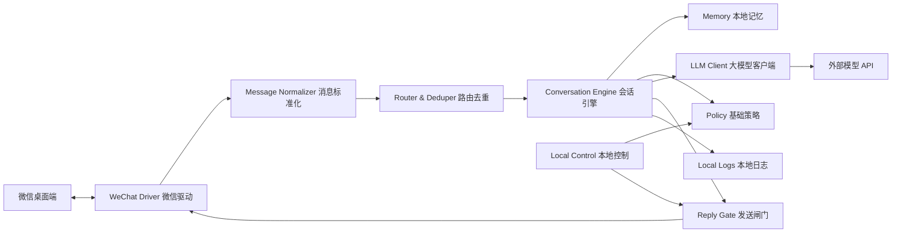

# 个人微信聊天机器人简化设计书

版本：v0.1
日期：2026-06-04
状态：基于“个人微信号、本地使用、非生产部署”的简化方案

## 1. 简化目标

目标是做一个本地运行的个人微信聊天机器人：监听个人微信里的聊天消息，调用外部大模型 API 生成回复，再把回复发回对应聊天窗口。

这个版本不追求生产级高可用，不接微信公众号，不做企业级管理台，不做多租户，不做复杂部署。重点是本机可用、可测试、可暂停、可控风险。

## 2. 重要边界

### 2.1 默认做

- 个人私聊自动回复。
- 外接一个大模型 API。
- 本地保存必要的会话上下文。
- 联系人白名单。
- 机器人全局暂停和单会话暂停。
- 基础日志和消息回放测试。
- 开发阶段支持“只生成不发送”模式。

### 2.2 默认不做

- 微信公众号、企业微信、微信开放平台接入。
- 生产级部署、云端高可用、多实例。
- 群发、营销、主动打扰用户。
- 朋友圈、红包、转账、支付、扫码、加好友等操作。
- 绕过平台限制、反检测、协议逆向等高风险能力。
- 默认群聊自动回复。

### 2.3 风险说明

个人微信自动化不是微信官方面向机器人的稳定生产接入方式，可能存在版本变动、误触发、账号限制或封号风险。这个简化方案只把它作为个人本地工具来设计，并且默认加入白名单、暂停开关和人工确认模式。

## 3. 极简架构



核心思路：

- 微信相关能力只放在 `WeChat Driver`。
- 其他模块不关心微信怎么被操控。
- 开发和测试时用 `Fake WeChat Driver` 替代真实微信。
- 初期可以先只生成回复，不自动发送，确认稳定后再打开自动发送。

## 4. 简化模块

### S01 WeChat Driver：个人微信驱动

职责：

- 发现新消息。
- 识别发送者、聊天窗口、消息文本和时间。
- 发送文本回复。
- 提供暂停、恢复、只读模式。

推荐接口：

```json
{
  "read_new_messages": "读取新消息列表",
  "send_message": "发送文本到指定会话",
  "focus_chat": "定位指定聊天窗口",
  "health_check": "检查微信是否在线和可操作"
}
```

独立测试：

- 使用 `FakeWeChatDriver` 输入消息 fixture。
- 验证同一条消息不会重复上报。
- 验证发送接口只收到目标会话和文本，不直接测试真实微信。

待 grill：

- 你使用的是 Windows 微信桌面版吗？
- 是否接受基于桌面 UI 自动化的方式？
- 是否允许开发阶段先做“只生成不发送”？
- 是否只回复白名单联系人？

### S02 Message Normalizer：消息标准化

职责：

- 把驱动读到的原始消息转成统一格式。
- 生成 `message_id`、`conversation_id`、`sender_name`。
- 过滤空消息、自己发出的消息、系统提示。

标准消息草案：

```json
{
  "message_id": "string",
  "conversation_id": "string",
  "sender_name": "string",
  "text": "string",
  "is_group": false,
  "received_at": "2026-06-04T00:00:00+08:00"
}
```

独立测试：

- 用原始消息样本测试解析。
- 用自己发送的消息样本测试过滤。
- 用重复消息样本测试稳定 ID。

### S03 Router & Deduper：路由与去重

职责：

- 判断消息是否需要处理。
- 防止重复回复。
- 按会话维度串行处理消息。
- 应用联系人白名单、黑名单和群聊开关。

独立测试：

- 重复消息只处理一次。
- 非白名单联系人被忽略。
- 群聊默认被忽略。

### S04 Conversation Engine：会话引擎

职责：

- 组织上下文。
- 构造 prompt。
- 调用大模型。
- 生成回复决策。
- 决定回复、忽略、暂停、转人工或只记录。

独立测试：

- 使用 fake LLM 固定返回，验证流程。
- 验证暂停状态下不调用模型。
- 验证不同联系人上下文不串号。

### S05 LLM Client：大模型客户端

职责：

- 调用外部大模型 API。
- 管理 API key、模型名、超时、重试。
- 记录 token 用量、错误和延迟。
- 模型失败时返回降级结果。

独立测试：

- fake provider 测试成功、超时、限流、错误。
- 验证 API key 不写入日志。
- 验证模型切换不影响会话引擎。

待 grill：

- 你准备用哪个模型 API？
- 是否已有 API key？
- 最大可接受回复延迟是多少？
- 回复要短句风格还是详细风格？

### S06 Memory：本地记忆

职责：

- 保存最近 N 轮对话。
- 可选保存联系人偏好。
- 支持一键清空指定联系人记忆。
- 支持关闭记忆。

MVP 存储：

- JSONL 文件或 SQLite。

独立测试：

- 写入、读取、清空。
- 不同联系人隔离。
- 超过上下文长度后自动截断。

待 grill：

- 是否需要长期记忆？
- 聊天记录保存多久？
- 是否有任何内容绝对不能保存？

### S07 Policy：基础策略

职责：

- 全局开关。
- 单联系人开关。
- 白名单和黑名单。
- 回复频率限制。
- 敏感词和高风险话题拦截。
- 发送前人工确认模式。

独立测试：

- 白名单命中。
- 频控命中。
- 敏感词命中。
- 人工确认模式下不直接发送。

### S08 Reply Gate：发送闸门

职责：

- 决定模型回复是否真正发出。
- 支持 dry-run，只记录不发送。
- 支持人工确认后发送。
- 支持自动发送。

三种模式：

- `dry_run`：只生成和记录，不发微信。
- `confirm`：生成后等待你确认。
- `auto`：符合策略就自动发送。

建议开发顺序：

- 先 `dry_run`。
- 再 `confirm`。
- 最后只对白名单联系人开放 `auto`。

### S09 Local Control：本地控制

职责：

- 启动和停止机器人。
- 切换发送模式。
- 管理白名单。
- 查看最近日志。
- 清空联系人记忆。

MVP 形态：

- 命令行配置文件。
- 后续可做一个本地 Web 小面板。

独立测试：

- 配置读取和校验。
- 开关状态变更。
- 白名单更新。

### S10 Local Logs：本地日志与回放

职责：

- 保存入站消息、模型请求摘要、回复结果、发送状态。
- 支持脱敏。
- 支持用历史消息回放测试。

独立测试：

- 日志字段完整。
- 敏感字段脱敏。
- 历史消息可回放。

## 5. 最小数据文件建议

```text
data/
  config.json
  contacts_whitelist.json
  conversations.sqlite
  logs.jsonl
  replay_cases/
```

`config.json` 示例：

```json
{
  "mode": "dry_run",
  "allow_group_chat": false,
  "memory_enabled": true,
  "max_history_turns": 12,
  "llm": {
    "provider": "openai_compatible",
    "model": "your-model-name",
    "timeout_seconds": 20
  }
}
```

API key 不放进 `config.json`，只走环境变量或本地 secrets 文件，并且不提交到仓库。

## 6. 推荐开发顺序

### Phase 0：把关键细节问清楚

必须确认：

- 操作系统和微信客户端版本。
- 是否接受桌面 UI 自动化。
- 模型供应商。
- 自动发送范围。
- 是否需要群聊。
- 是否需要长期记忆。

### Phase 1：无微信、无真实模型的核心闭环

目标：

- `FakeWeChatDriver` 输入一条消息。
- `FakeLLMClient` 返回固定回复。
- 会话引擎生成回复。
- `ReplyGate` 在 dry-run 下记录结果。

验收：

- 不打开微信也能跑通端到端测试。

### Phase 2：接真实模型

目标：

- 接入真实大模型 API。
- 保留 fake 微信。
- 能在命令行看到模型回复。

验收：

- 模型超时、失败、限流都有降级。

### Phase 3：微信只读监听

目标：

- 读取个人微信新消息。
- 不发送回复。
- 把模型回复写入日志。

验收：

- 不误读自己发出的消息。
- 不重复处理同一条消息。

### Phase 4：人工确认发送

目标：

- 模型生成回复后等待确认。
- 确认后通过微信驱动发送。

验收：

- 未确认不发送。
- 发送对象和内容可见、可取消。

### Phase 5：白名单自动回复

目标：

- 只对白名单联系人启用自动回复。
- 保留全局暂停和单会话暂停。

验收：

- 非白名单永不自动回复。
- 高频消息触发冷却。
- 任意时刻可一键暂停。

## 7. 与完整版相比删除的模块

删除或弱化：

- 公网 HTTP 回调。
- 微信公众号适配器。
- 企业微信适配器。
- 生产消息队列。
- 多实例部署。
- 企业级 Admin Console。
- 完整监控告警。
- 多租户权限系统。

保留但简化：

- 微信适配器。
- 大模型客户端。
- 会话上下文。
- 基础风控。
- 本地日志。
- 本地测试工具。

## 8. 后续开发汇报规则

每次开发或 debug 后，必须汇报：

- 修改位置：具体文件和主要函数。
- 修改内容：改了什么。
- 验证方式：跑了什么命令或测试。
- 结果：通过、失败或未执行原因。
- 仍需你确认的问题。

如果涉及微信驱动、自动发送、模型供应商、记忆保存、群聊、敏感内容、账号风险这些不明确点，必须先 grill you，再动代码。

## 9. 下一步必须 grill 你的问题

进入任何代码开发前，请先回答：

- 你的运行环境是 Windows 吗？使用微信桌面版吗？
- 你是否接受桌面 UI 自动化方式控制微信？
- 第一版是否只做 `dry_run`，先不自动发送？
- 自动回复范围是全部私聊，还是只对白名单联系人？
- 是否需要群聊？如果需要，是只在被 @ 时回复，还是所有消息都回复？
- 使用哪个大模型 API？是否已有 key？
- 是否需要保存长期记忆？聊天记录保存多久？
