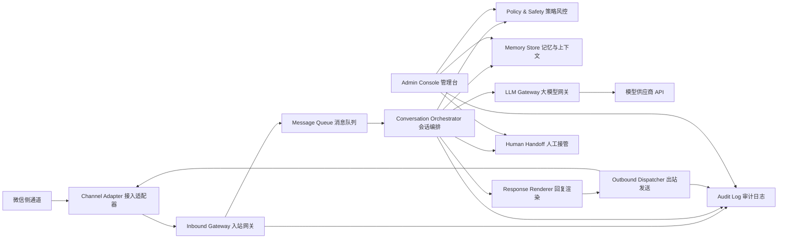

# 微信聊天机器人模块化设计书

版本：v0.1
日期：2026-06-04
状态：基础计划，待逐模块细化

## 1. 目标与边界

目标是部署一个可接入大模型 API 的微信聊天机器人，用于接收微信侧消息、生成回复、执行安全审查，并通过微信侧通道自动回复用户。

本设计优先采用微信官方可支持的接入方式，例如微信公众号、企业微信自建应用或企业微信智能机器人。若目标是操控个人微信号，需要单独确认合规、封号风险、自动化方式和可接受的稳定性边界；个人微信自动化不进入默认 MVP。

### 1.1 MVP 范围

- 接收文本消息。
- 调用外部大模型 API 生成文本回复。
- 支持单轮与多轮上下文。
- 支持基础风控：频控、黑白名单、敏感词、人工接管。
- 支持消息日志、错误日志、可重放测试。
- 支持至少一种微信官方接入适配器。

### 1.2 非 MVP 范围

- 未经确认的个人微信桌面端或手机端 UI 自动化。
- 群聊复杂治理、主动营销群发、朋友圈操作。
- 支付、订单、CRM 等业务系统深度集成。
- 语音、图片、文件、多模态回复。
- 多机器人、多租户 SaaS 化。

## 2. 关键约束

### 2.1 微信平台约束

- 微信生态对主动消息、客服消息、被动回复、群聊消息有不同限制。
- 公众号被动回复通常要求快速返回，长耗时大模型调用需要异步或缓存策略。
- 客服消息通常受用户最近交互窗口、发送次数、账号类型和认证状态影响。
- 企业微信适合组织内或企业客户服务场景，接入形态更适合机器人化。
- 个人微信自动化通常不是稳定、正式、低风险的生产接入方式。

### 2.2 合规与运营约束

- 不绕过平台限制，不做骚扰式主动消息。
- 默认只回复用户主动发来的消息或平台允许的事件窗口。
- 必须支持人工接管、停用机器人、用户拉黑、日志审计。
- 用户隐私数据最小化采集，敏感信息脱敏存储。

### 2.3 技术约束

- 所有模块通过明确接口通信，便于独立开发和测试。
- 模型供应商可替换，避免业务逻辑绑定单一大模型。
- 微信接入适配器可替换，避免核心聊天逻辑依赖公众号、企业微信或个人微信实现。
- 关键路径必须可观测：消息入口、队列、模型调用、回复发送都要有 trace_id。

## 3. 总体架构



### 3.1 核心原则

- 接入层只负责微信协议，不负责生成回答。
- 编排层只处理会话状态、工具调用、模型选择和回复策略，不关心微信具体 API。
- 大模型网关只负责模型调用、重试、限流和成本统计。
- 风控模块必须在模型调用前后都能介入。
- 所有外部系统都通过接口包装，单元测试中可用 mock 替代。

## 4. 模块拆分

### M01 Channel Adapter：微信接入适配器

职责：

- 接收微信侧事件或消息。
- 完成签名校验、消息解密、格式解析。
- 将微信消息转换为统一的 `InboundMessage`。
- 将统一的 `OutboundMessage` 转换为微信侧发送动作。

候选适配器：

- `wechat_official_account_adapter`：微信公众号。
- `wecom_app_adapter`：企业微信自建应用。
- `wecom_ai_bot_adapter`：企业微信智能机器人。
- `personal_wechat_adapter`：个人微信自动化，仅作为待确认实验路径。

输入：

- 微信平台 HTTP 回调、WebSocket 事件或自动化采集到的消息。

输出：

- 标准化消息对象。
- 发送结果对象。

独立测试：

- 使用微信回调样例 fixture 测试签名、解密、解析。
- 使用 mock 微信客户端测试发送参数。
- 回放真实脱敏消息样本，确保幂等处理。

验收标准：

- 同一条消息重复投递时不会重复触发模型回复。
- 微信平台校验失败时拒绝处理并记录原因。
- 通道错误不会污染核心会话状态。

待 grill：

- 你要接入公众号、企业微信，还是坚持个人微信号？
- 是否已有认证公众号或企业微信主体？
- 是否必须支持群聊？
- 是否需要支持用户主动私聊以外的场景？

### M02 Inbound Gateway：入站网关

职责：

- 接收适配器标准消息。
- 分配 `trace_id`、`message_id`、`conversation_id`。
- 做基础去重、时间戳校验、来源校验。
- 将消息写入队列或直接转发给编排层。

输入：

- `InboundMessage`。

输出：

- `NormalizedMessage`。
- 队列任务。

独立测试：

- 构造重复消息，验证只生成一个处理任务。
- 构造过期消息，验证进入丢弃或审计流程。
- 构造不同通道消息，验证 conversation key 生成稳定。

验收标准：

- 任意消息都有可追踪 ID。
- 重复投递不会造成重复回复。
- 入站异常不影响其他消息处理。

### M03 Message Queue：消息队列

职责：

- 缓冲入站消息，削峰填谷。
- 支持失败重试、死信队列、延迟任务。
- 支持按 conversation_id 做串行处理，避免同一会话上下文竞争。

候选实现：

- MVP：内存队列或数据库任务表。
- 生产：Redis Stream、RabbitMQ、Kafka、云队列。

独立测试：

- 单会话多消息顺序测试。
- 多会话并发测试。
- 失败重试和死信测试。

验收标准：

- 同一会话消息顺序可控。
- 模型 API 慢或失败时不会阻塞接收入口。
- 重启后未完成任务可恢复，具体取决于选型。

### M04 Conversation Orchestrator：会话编排

职责：

- 读取用户消息和上下文。
- 判断是否需要机器人回复、人工接管或静默。
- 组织系统提示词、角色设定、历史摘要、工具结果。
- 调用风控、记忆、模型、回复渲染、出站发送。

输入：

- `NormalizedMessage`。

输出：

- `ReplyDecision`。
- `OutboundMessage`。
- 审计事件。

独立测试：

- 用 mock LLM 验证不同用户消息的决策分支。
- 用固定上下文验证提示词构造稳定。
- 验证人工接管状态下机器人不会自动回复。

验收标准：

- 每条消息都有明确处理结果：已回复、已忽略、人工接管、失败待重试。
- 会话上下文不会串号。
- 编排层不依赖具体微信 SDK。

### M05 LLM Gateway：大模型网关

职责：

- 封装外部模型 API。
- 支持多供应商、多模型、超时、重试、熔断、限流。
- 记录 token 用量、延迟、错误码、成本估算。
- 支持模型返回内容的结构化解析。

候选供应商：

- OpenAI 兼容 API。
- 国内模型供应商。
- 本地模型或私有化模型网关。

独立测试：

- 使用 fake provider 测试成功、超时、限流、错误返回。
- 使用录制响应 fixture 测试解析。
- 压测并发请求和限流策略。

验收标准：

- 供应商切换不影响编排层接口。
- API key 不进入日志。
- 模型超时有可控降级回复。

待 grill：

- 目标大模型供应商是哪家？
- 是否需要流式输出？
- 单次回复最大延迟能接受多少秒？
- 预算和 token 上限是多少？

### M06 Prompt & Persona：提示词与人格配置

职责：

- 管理机器人身份、语气、业务规则和禁止事项。
- 支持不同会话、不同用户或不同场景使用不同 prompt。
- 支持版本化和灰度。

输入：

- 用户画像、业务场景、上下文摘要、管理员配置。

输出：

- `PromptBundle`。

独立测试：

- prompt snapshot 测试。
- 禁止事项注入测试。
- 多场景 prompt 选择测试。

验收标准：

- prompt 可配置、可回滚。
- 不把敏感密钥或内部实现泄露给模型。
- 系统规则优先级明确。

### M07 Memory Store：记忆与上下文

职责：

- 存储会话历史、用户偏好、长期记忆和摘要。
- 控制上下文窗口，避免无限堆历史消息。
- 支持隐私清理、用户删除、数据保留期限。

候选存储：

- MVP：SQLite 或 PostgreSQL。
- 缓存：Redis。
- 语义检索：向量数据库或数据库向量扩展。

独立测试：

- 会话历史读写测试。
- 摘要生成 mock 测试。
- 数据隔离和删除测试。

验收标准：

- 不同用户记忆隔离。
- 可按 conversation_id 重放上下文。
- 可配置保留周期和脱敏策略。

待 grill：

- 是否希望机器人记住用户长期信息？
- 哪些内容禁止保存？
- 日志和会话记录要保存多久？

### M08 Policy & Safety：策略风控

职责：

- 入站前置策略：黑名单、白名单、频控、命令识别。
- 模型前策略：是否允许调用模型、是否需要人工接管。
- 模型后策略：敏感内容过滤、幻觉风险提示、禁止承诺。
- 出站策略：发送窗口、次数限制、冷却时间。

独立测试：

- 黑白名单测试。
- 高频刷屏测试。
- 敏感词和高风险意图测试。
- 人工接管阻断测试。

验收标准：

- 风控命中原因可审计。
- 策略配置可热更新或低成本重启生效。
- 默认策略偏保守。

### M09 Response Renderer：回复渲染

职责：

- 将模型输出转为微信可发送格式。
- 控制长度、分段、表情、链接、Markdown 或纯文本兼容。
- 处理降级回复、错误回复、人工接管提示。

独立测试：

- 超长文本分段测试。
- 特殊字符转义测试。
- 不同通道格式兼容测试。

验收标准：

- 不发送微信侧不支持的格式。
- 长回复不会丢失关键内容。
- 降级文案统一且可配置。

### M10 Outbound Dispatcher：出站发送

职责：

- 调用适配器发送回复。
- 处理发送重试、限流、失败记录。
- 支持延迟发送和取消发送。

独立测试：

- mock adapter 成功和失败测试。
- 重试次数测试。
- 通道限流测试。

验收标准：

- 发送失败可追踪。
- 不因单个用户发送失败影响其他会话。
- 遵守通道侧发送窗口和频次限制。

### M11 Admin Console：管理台

职责：

- 查看会话、日志、机器人状态。
- 配置 prompt、模型、风控、黑白名单。
- 人工接管、恢复机器人、手动回复。
- 查看成本、延迟、错误率。

MVP 形态：

- 先做命令行或最小 Web UI。
- 后续再做完整后台。

独立测试：

- 权限测试。
- 配置保存和回滚测试。
- 人工接管流程测试。

验收标准：

- 管理操作都有审计记录。
- 非管理员不能查看敏感数据。
- 可一键停用机器人。

### M12 Observability：日志、监控与审计

职责：

- 结构化日志。
- 指标：入站量、回复量、模型延迟、错误率、token 用量。
- trace：从微信入站到模型调用到出站发送全链路追踪。
- 审计：人工操作、策略命中、异常事件。

独立测试：

- 日志字段完整性测试。
- trace_id 贯穿测试。
- 错误告警模拟测试。

验收标准：

- 可以定位任意一条回复的生成原因和发送结果。
- 日志不泄露 API key、token、密钥。
- 核心异常可告警。

### M13 Config & Secrets：配置与密钥

职责：

- 管理环境变量、密钥、模型配置、微信配置。
- 区分 dev、test、prod 环境。
- 支持配置校验和启动前检查。

独立测试：

- 缺失配置启动失败测试。
- 密钥脱敏输出测试。
- 环境切换测试。

验收标准：

- 密钥不入库。
- 配置错误能在启动时明确报错。
- 测试环境可使用 mock secrets。

### M14 Test Harness：测试工具与模拟器

职责：

- 提供微信消息 fixture。
- 提供 fake LLM。
- 提供 fake channel adapter。
- 支持消息重放和端到端本地测试。

独立测试：

- 使用固定输入验证固定输出。
- 回归测试关键对话路径。
- 模拟超时、重复投递、发送失败。

验收标准：

- 不依赖真实微信即可测试核心链路。
- 不依赖真实模型即可测试编排逻辑。
- 每个模块可以单独跑测试。

## 5. 核心数据契约草案

### 5.1 InboundMessage

```json
{
  "channel": "wechat_official_account",
  "channel_message_id": "string",
  "sender_id": "string",
  "receiver_id": "string",
  "conversation_id": "string",
  "message_type": "text",
  "text": "string",
  "raw_payload_ref": "string",
  "timestamp": "2026-06-04T00:00:00Z"
}
```

### 5.2 NormalizedMessage

```json
{
  "trace_id": "string",
  "message_id": "string",
  "conversation_id": "string",
  "user_id": "string",
  "channel": "wechat_official_account",
  "type": "text",
  "content": {
    "text": "string"
  },
  "received_at": "2026-06-04T00:00:00Z",
  "metadata": {}
}
```

### 5.3 ReplyDecision

```json
{
  "trace_id": "string",
  "conversation_id": "string",
  "action": "reply",
  "reason": "normal_chat",
  "requires_human": false,
  "policy_hits": []
}
```

`action` 可选值：

- `reply`
- `ignore`
- `handoff`
- `defer`
- `fail`

### 5.4 OutboundMessage

```json
{
  "trace_id": "string",
  "conversation_id": "string",
  "recipient_id": "string",
  "channel": "wechat_official_account",
  "message_type": "text",
  "text": "string",
  "send_policy": {
    "allow_retry": true,
    "max_retry": 3
  }
}
```

## 6. 推荐开发顺序

### Phase 0：需求澄清与接入方式确认

目标：

- 确认微信接入路径。
- 确认模型供应商。
- 确认部署环境。
- 确认数据保留和风控边界。

产出：

- 接入方式决策记录。
- MVP 功能清单。
- 风险接受清单。

### Phase 1：可测试核心骨架

目标：

- 建立统一消息契约。
- 建立 fake channel、fake LLM、编排层。
- 本地完成一条消息从入站到回复的闭环。

涉及模块：

- M02 Inbound Gateway
- M03 Message Queue
- M04 Conversation Orchestrator
- M05 LLM Gateway
- M09 Response Renderer
- M10 Outbound Dispatcher
- M14 Test Harness

验收：

- 不接真实微信、不接真实模型，也能跑通端到端测试。

### Phase 2：真实模型接入

目标：

- 接入一个真实大模型供应商。
- 增加超时、重试、限流、成本记录。

涉及模块：

- M05 LLM Gateway
- M06 Prompt & Persona
- M12 Observability
- M13 Config & Secrets

验收：

- 可用真实模型完成文本回复。
- 模型异常时有降级回复。

### Phase 3：真实微信通道接入

目标：

- 接入已确认的微信官方通道。
- 完成签名校验、消息解析、发送。

涉及模块：

- M01 Channel Adapter
- M02 Inbound Gateway
- M10 Outbound Dispatcher
- M12 Observability

验收：

- 真实微信消息可触发机器人回复。
- 重复回调不会重复回复。

### Phase 4：风控、记忆与人工接管

目标：

- 加入上下文记忆。
- 加入黑白名单、频控、敏感内容策略。
- 加入人工接管。

涉及模块：

- M07 Memory Store
- M08 Policy & Safety
- M11 Admin Console

验收：

- 人工接管后机器人停止自动回复。
- 高频消息被限制。
- 上下文记忆可开启、关闭、清理。

### Phase 5：部署与运维

目标：

- 完成生产部署配置。
- 加入日志、监控、告警。
- 建立备份和恢复策略。

涉及模块：

- M03 Message Queue
- M12 Observability
- M13 Config & Secrets

验收：

- 服务重启后可恢复处理。
- 关键错误可告警。
- 有上线、回滚、密钥轮换流程。

## 7. 部署草案

### 7.1 MVP 单机部署

组件：

- Web 服务：接收微信回调和管理 API。
- Worker：处理队列、调用模型、发送回复。
- SQLite 或 PostgreSQL：保存会话、日志、配置。
- Redis：可选，用于队列和限流。

优点：

- 简单、低成本、易调试。

限制：

- 高可用和扩展性有限。

### 7.2 生产部署

组件：

- API 服务多实例。
- Worker 多实例。
- PostgreSQL。
- Redis 或专业消息队列。
- 反向代理和 HTTPS。
- 日志与监控系统。

关键要求：

- 微信回调 URL 必须公网可访问并配置 HTTPS，具体以所选微信通道要求为准。
- 密钥通过环境变量或密钥管理服务注入。
- 数据库定期备份。

## 8. 测试策略

### 8.1 单元测试

- 每个模块只测试自身逻辑。
- 外部依赖全部 mock。
- 核心数据契约做 schema 校验。

### 8.2 集成测试

- fake channel + real orchestrator + fake LLM。
- real LLM + fake channel。
- real adapter sandbox 或测试账号 + fake LLM。

### 8.3 端到端测试

- 测试账号向微信通道发送消息。
- 验证系统收到消息、生成回复、发送成功。
- 验证日志可追踪整条链路。

### 8.4 回放测试

- 将脱敏后的真实消息保存为 fixture。
- 每次改动后回放关键场景。
- 对回复不做完全相等断言，而断言安全、格式、决策和结构。

## 9. 风险清单

| 风险 | 影响 | 缓解 |
| --- | --- | --- |
| 个人微信自动化被限制或封号 | 服务不可用，账号风险 | 优先官方通道；个人微信仅实验并需确认风险 |
| 大模型回复慢 | 微信被动回复超时 | 队列、缓存、异步客服消息、降级回复 |
| 重复回调导致重复回复 | 用户体验差 | 入站去重、幂等键、发送记录 |
| 模型幻觉或违规回复 | 合规和品牌风险 | prompt 约束、后置风控、人工接管 |
| API key 泄露 | 安全事故 | secrets 管理、日志脱敏、权限隔离 |
| 上下文串号 | 隐私事故 | conversation_id 隔离测试、数据访问约束 |
| 发送频率超限 | 回复失败或账号风险 | 出站策略、限流、窗口校验 |

## 10. 必须 grill 的问题池

后续任何开发前，如果下列问题没有答案，应先追问，不做高风险假设。

### 10.1 微信接入

- 你要使用公众号、企业微信，还是个人微信号？
- 如果是公众号，账号类型是订阅号还是服务号？是否认证？
- 如果是企业微信，是自建应用、群机器人，还是智能机器人？
- 是否需要私聊、群聊，还是两者都要？
- 是否允许只回复用户主动发来的消息？
- 是否需要主动推送消息？如果需要，触发条件是什么？

### 10.2 机器人行为

- 机器人角色是什么？
- 允许聊哪些话题？
- 明确禁止聊哪些话题？
- 遇到不确定问题时，是拒答、转人工，还是给保守建议？
- 是否需要固定话术、品牌语气或语言风格？

### 10.3 模型与成本

- 使用哪个模型供应商？
- 是否已有 API key？
- 可接受的平均延迟和最大延迟是多少？
- 每日或每月预算是多少？
- 是否需要国内可访问的模型服务？

### 10.4 数据与隐私

- 会话记录保存多久？
- 是否保存用户画像和长期记忆？
- 哪些字段必须脱敏？
- 用户是否能要求删除历史？
- 是否有企业内部合规要求？

### 10.5 运维

- 部署在哪里：本机、云服务器、NAS、公司内网？
- 是否已有域名和 HTTPS 证书？
- 是否需要 Docker？
- 是否需要监控告警？
- 谁有管理台权限？

## 11. 后续开发汇报规则

每次开发或 debug 后，必须向你汇报：

- 修改位置：文件路径、主要函数或模块。
- 修改内容：做了什么、为什么做。
- 验证方式：跑了哪些测试或命令。
- 结果：通过、失败或未执行原因。
- 风险与下一步：仍然不确定或需要你确认的点。

任何需求、接入路径、账号能力、模型能力、数据保留、合规边界不明确时，必须先 grill you，再写代码。

## 12. 初步技术栈建议

默认建议：

- 后端语言：Python 或 Node.js，按你后续偏好决定。
- Web 框架：FastAPI 或 NestJS/Express。
- 数据库：PostgreSQL；MVP 可 SQLite。
- 队列：Redis Stream 或数据库任务表；MVP 可内存队列。
- 测试：pytest 或 vitest/jest。
- 部署：Docker Compose 起步，后续再拆服务。

选择原则：

- 如果你更看重快速接模型和数据处理，优先 Python + FastAPI。
- 如果你更看重微信生态 JS SDK、前端管理台一体化，优先 Node.js + TypeScript。
- 无论选哪套，模块接口保持一致，方便替换实现。

## 13. 下一步决策

建议下一步先完成 Phase 0，重点确认：

- 微信接入路径。
- 大模型供应商。
- 部署环境。
- 是否需要长期记忆。
- 是否需要群聊。
- 是否接受个人微信自动化风险。

确认后再进入 Phase 1，先做 fake channel + fake LLM 的可测试核心骨架。
