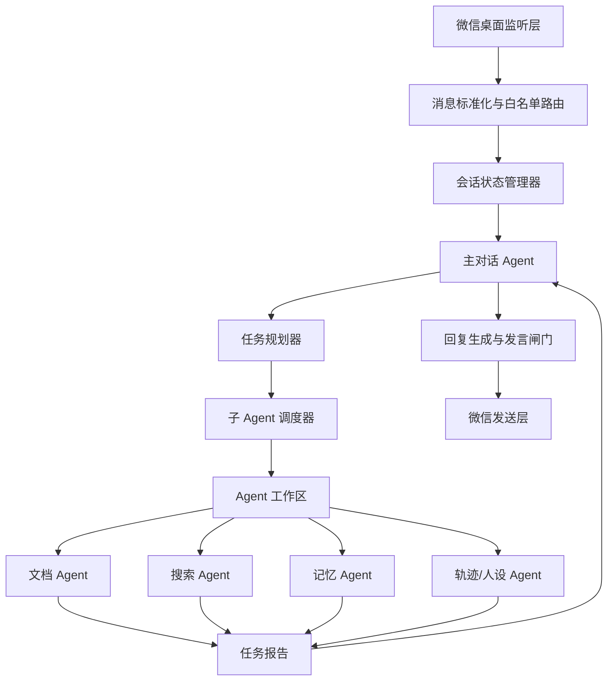
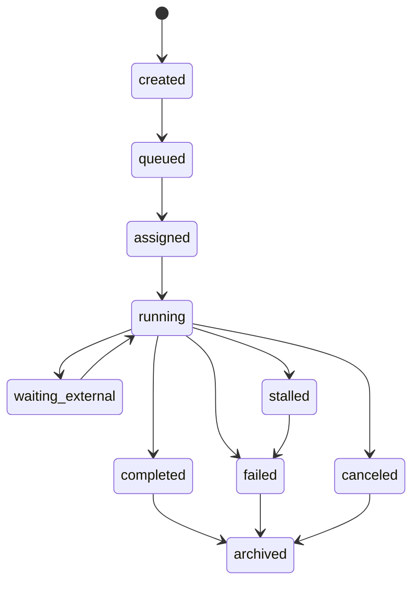

# 个人微信机器人 Agent 架构重组计划书

## 0. 当前模型调试结论

### 0.1 对话 API

- 用途：主对话、任务规划、上下文理解、摘要、失败回复生成。
- 模型：`gpt-5.5`
- 测试结果：通过。
- 真实端点：`/v1/chat/completions`
- 现象：新对话 key 的模型列表只暴露 `gpt-5.5`，实际对话请求可返回 `200`。

### 0.2 绘图能力

- 当前结论：废弃，不再作为当前版本主线目标。
- 不再继续投入绘图 key、绘图接口和绘图调试。
- 如后续确有需要，再独立开分支重做，不和主聊天链路耦合。

### 0.3 已落地的测试工具变化

- `scripts/model_smoke_test.py` 默认只测对话 API；图像检查变成显式 opt-in。
- 支持跳过单侧测试：`--skip-chat`、`--skip-image`。
- 请求头已加入浏览器型 `User-Agent`，避免中转站入口层对 Python 默认请求头返回 `403 / 1010`。

## 1. 重组目标

新的架构以“主对话 agent”为唯一前台人格与决策中心。所有复杂任务都由主 agent 先分析任务流程，再将任务分发到服务器端专用工作目录中的子 agent。子 agent 只负责执行明确任务，并通过文件、事件和报告把结果交还给主 agent。

目标不是生产级分布式系统，而是一个可以在 Windows 桌面个人微信场景里稳定演进的本地 agent 编排系统：

- 主 agent 负责微信上下文、人格一致性、发言时机、任务规划、结果整合。
- 子 agent 负责文档、搜索、记忆、后台轨迹、批处理等可独立测试的任务。
- 所有 agent 之间通过标准任务协议通信，不直接互相读写内部状态。
- 每个任务有独立目录，可复盘、可重试、可调试。
- 多个私聊、多个群聊、多主题对话可以并发推进，但发言出口统一由主 agent 控制。
- 失败时前台回复自然、简短；后台保留详细错误报告用于开发调试。

## 2. 总体架构



## 3. 模块拆分

### 3.1 微信监听与发送模块

职责：

- 监听桌面微信私聊和群聊消息。
- 将微信原始消息转成统一 `IncomingMessage`。
- 只允许白名单联系人和白名单群进入后续流程。
- 发送文本、文件、图片。
- 对群聊使用群名作为主要匹配依据，继续保留群名修改工具。

独立测试：

- 使用 fixture 回放私聊、群聊、特殊名字、特殊群名。
- 使用 fake driver 验证发送文本、发送文件、发送图片的调用参数。

### 3.2 会话状态管理器

职责：

- 为每个私聊、群聊建立 `conversation_id`。
- 为群聊中的不同主题建立 `thread_id`。
- 保存最近 20 句上下文，用于主题判断和发言时机判断。
- 保存 3 周内完整聊天记录。
- 生成文件索引，供工具和子 agent 引用历史文件。

推荐 ID 规则：

- 私聊：`private:{wechat_id}`
- 群聊：`group:{normalized_group_name}`
- 群内主题线程：`group:{group_name}:topic:{topic_id}`

独立测试：

- 同一群聊内两个不同话题不会互相污染上下文。
- 同一用户在私聊和群聊中的上下文隔离。
- 3 周外记录能被清理，但长期风格记忆不被误删。

### 3.3 主对话 Agent

职责：

- 作为唯一前台人格。
- 判断是否需要回复、沉默、稍后回复、调用工具或派发子 agent。
- 生成并维护可变任务计划书。
- 任何任务分发、重试、取消或修复前，必须先写入计划书修订。
- 管理与子 agent 的上下文传递。
- 接收子 agent 报告后整合为自然聊天回复。
- 在群聊中自主决定是否发言，但必须经过冷却、主题、白名单和风险闸门。

主 agent 每次处理消息分五步：

1. `observe`：读取最近上下文、白名单、群聊状态、未完成任务。
2. `plan`：判断当前是普通聊天、工具任务、后台任务还是多阶段任务。
3. `record_plan`：把即将执行的计划写入可变计划书。
4. `dispatch_or_reply`：能直接答就直接答，需要工具就创建子任务。
5. `summarize`：把结果转成自然朋友聊天风格的回复。

独立测试：

- 普通聊天不误触工具。
- 明确命令可以触发工具任务。
- 群聊冷却期内不发言。
- 长任务开始后能先发自然等待说明。
- 子 agent 失败后能生成自然失败回复。

### 3.4 任务规划器与可变计划书

职责：

- 把用户输入拆成任务步骤。
- 判断任务是否需要子 agent。
- 选择子 agent 类型。
- 给每个子 agent 打包最小必要上下文。
- 生成任务监控点。
- 在实际分发前写入 `PlanBook`。
- 子 agent 状态异常时，先写入修订计划，再执行修复动作。
- 所有任务状态变化都必须记录到 `events.jsonl`，并同步维护 `status.json` 当前态。

输出对象：`TaskPlan`

关键字段：

- `plan_id`
- `conversation_id`
- `thread_id`
- `user_goal`
- `steps`
- `required_agents`
- `input_refs`
- `context_refs`
- `deadline_policy`
- `front_reply_policy`
- `failure_reply_policy`
- `revision`
- `dispatch_intent`
- `agent_status_snapshot`
- `repair_policy`

计划书修订规则：

- 每次用户触发复杂任务，主 agent 创建一个 `plan_id`。
- 每次分发子任务前，主 agent 追加一个 `plan_revision`。
- 每次发现子 agent 异常、超时、失败或输出不合格，主 agent 必须先追加修订，再重试、取消、替换或改答。
- 子 agent 不能直接修改计划书，只能在 `report.json` 中提交申请。

独立测试：

- 文档翻译请求会派给文档 Agent。
- 搜索请求会派给搜索 Agent。
- 纯聊天不会创建任务目录。
- 已写计划但 worker 异常时，会产生修订计划而不是直接裸重试。

### 3.5 子 Agent 调度器

职责：

- 接收 `TaskPlan`。
- 只接受主 agent 分发的任务，不接受子 agent 直接派单。
- 在专用工作目录创建任务。
- 写入 `request.json`、上下文包和输入文件引用。
- 为每个任务拉起一个本地独立短进程 worker。
- 跟踪状态、心跳、超时、失败和完成。
- 记录并管理所有状态变化，不只记录最终成功或失败。
- 将 `report.json` 交还主 agent。

初期使用本地独立短进程 worker、本地文件队列加 SQLite 事件表，不直接上消息队列。

任务状态机：



独立测试：

- 创建任务目录后能被 worker 发现。
- 子 agent 完成后能写回报告。
- 子 agent 崩溃时状态进入 `failed`。
- 每次状态变化都会写入 `events.jsonl`。
- 心跳超时但仍有进展时进入 `waiting_external`，而不是误杀。

### 3.6 Agent 工作区

建议目录：

```text
data/
  agent_workspace/
    plans/
      {plan_id}/
        plan.json
        revisions.jsonl
        events.jsonl
    tasks/
      {task_id}/
        request.json
        context_bundle.json
        input_refs.json
        status.json
        events.jsonl
        heartbeat.json
        input_files/
        working/
        output/
        report.json
        debug/
    agents/
      document_agent/
      search_agent/
      memory_agent/
      persona_agent/
    registry.json
```

约束：

- 子 agent 只能写自己的任务目录。
- 子 agent 不能直接发送微信消息。
- 子 agent 不能直接改主会话状态，只能写报告。
- 子 agent 不能创建新任务，只能提交 `main_agent_request` 让主 agent 审批。
- 主 agent 通过 `report.json` 和 `output/` 读取结果。
- 所有文件引用用 `file_id` 或相对任务目录路径传递，不在 prompt 里塞大文件全文。

独立测试：

- 任务目录结构可创建、可清理、可归档。
- 输出文件能进入全局文件索引。
- report 缺失时主 agent 能给出失败回复。

## 4. 子 Agent 类型

### 4.1 文档 Agent

职责：

- 解析 PDF、DOCX。
- 翻译文档。
- 输出 DOCX。
- 保留可复制 LaTeX。
- 保证数学公式渲染正确。
- 长书籍、长文献分块处理，最终合并。

输入：

- `input_files`
- 源语言、目标语言。
- 是否保留原文对照。
- 公式处理策略。

输出：

- 翻译 DOCX。
- 摘要。
- 处理日志。
- 公式异常列表。

### 4.2 搜索 Agent

职责：

- 通过浏览器自动化进行外网搜索。
- 默认 Google。
- 避免国内词条关键词和低质广告结果。
- 下载或保存完整来源内容。
- 用模型过滤无关内容。
- 前台默认返回真摘要和来源 URL。
- 如被要求全文，再由主 agent 调用本地原文。

输入：

- 查询目标。
- 语言偏好。
- 排除域名列表。
- 需要几条可信来源。

输出：

- 摘要。
- 来源 URL。
- 原文保存路径。
- 过滤掉的结果原因。

### 4.3 绘图能力历史预留

当前决策：

- 废弃绘图 key。
- 当前版本不实现绘图接口。
- 当前版本不创建绘图 Agent。
- 如后续恢复图像需求，必须作为独立能力重新设计，不影响主对话与工具任务链路。

### 4.4 记忆 Agent

职责：

- 把 3 周聊天记录提炼为长期风格记忆。
- 不直接训练模型，先维护本地风格档案和偏好档案。
- 为主 agent 提供可控的“说话风格提示”和“人设一致性提示”。

输入：

- 会话记录索引。
- 用户指定的人设背景。
- 每日轨迹。

输出：

- `style_memory.json`
- `relationship_memory.json`
- `topic_preferences.json`
- 可追溯来源引用。

### 4.5 人设轨迹 Agent

职责：

- 根据你后续提供的人设背景生成每日轨迹。
- 维护“今天它在做什么”的后台状态。
- 为主 agent 提供聊天时可自然引用的生活片段。
- 根据 topic 选择是否发言。

输出：

- 当日轨迹。
- 当前状态。
- 可提及话题。
- 不应提及话题。

### 4.6 子 Agent 间通信

默认不允许子 agent 直接互相发消息，也不允许子 agent 直接创建或派发新任务。所有跨 agent 协作都必须经由主 agent 审批。

需要申请协作的场景：

- 搜索 Agent 找到 PDF 后，需要文档 Agent 翻译。
- 文档 Agent 发现缺少外部背景，需要搜索 Agent 补资料。
- 记忆 Agent 需要读取搜索或文档结果生成长期偏好。

做法：

- 子 agent 在 `report.json` 中写 `main_agent_requests`。
- 主 agent 审查申请，并在可变计划书中追加修订。
- 只有主 agent 可以调用调度器创建新任务。
- 这样能保留任务链路，也避免多个 agent 同时抢状态。

## 5. 标准任务协议

### 5.1 plan.json

`plan.json` 只能由主 agent 写入。每次分发、修复、重试、取消前，主 agent 必须先追加计划修订。

```json
{
  "plan_id": "plan_20260610_000001",
  "conversation_id": "group:Study Group",
  "thread_id": "topic:paper_translation",
  "status": "active",
  "goal": "Translate the uploaded paper and return a docx file.",
  "current_revision": 2,
  "concurrency_policy": {
    "max_parallel_workers": 2,
    "overflow": "queue"
  },
  "revisions": [
    {
      "revision": 1,
      "kind": "initial_plan",
      "decision": "Create a document translation task.",
      "created_at": "2026-06-10T00:00:00+08:00"
    },
    {
      "revision": 2,
      "kind": "dispatch",
      "decision": "Dispatch task to document_agent worker.",
      "created_at": "2026-06-10T00:00:05+08:00"
    }
  ]
}
```

### 5.2 request.json

```json
{
  "task_id": "task_20260610_000001",
  "plan_id": "plan_20260610_000001",
  "plan_revision": 2,
  "parent_task_id": null,
  "conversation_id": "group:Study Group",
  "thread_id": "topic:paper_translation",
  "agent_type": "document_agent",
  "user_goal": "Translate this PDF into Chinese and preserve formulas.",
  "instructions": {
    "tone": "natural_friend_chat",
    "output_format": "docx",
    "front_reply": "summary_only"
  },
  "input_refs": [
    {
      "file_id": "file_001",
      "path": "input_files/paper.pdf",
      "kind": "pdf"
    }
  ],
  "context_refs": [
    {
      "kind": "recent_messages",
      "path": "context_bundle.json"
    }
  ],
  "created_at": "2026-06-10T00:00:00+08:00"
}
```

### 5.3 status.json

```json
{
  "task_id": "task_20260610_000001",
  "status": "running",
  "agent_type": "document_agent",
  "progress": {
    "stage": "translating_blocks",
    "current": 12,
    "total": 48
  },
  "last_heartbeat_at": "2026-06-10T00:05:00+08:00",
  "front_notice_sent": true
}
```

### 5.4 report.json

```json
{
  "task_id": "task_20260610_000001",
  "status": "completed",
  "summary": "The document was translated and formulas were preserved.",
  "output_refs": [
    {
      "file_id": "file_002",
      "path": "output/original_name_翻译.docx",
      "kind": "docx"
    }
  ],
  "source_refs": [],
  "main_agent_requests": [],
  "debug": {
    "duration_seconds": 420,
    "warnings": []
  }
}
```

## 6. 多会话与多并发设计

### 6.1 并发边界

系统里至少有四种并发：

- 多个私聊同时来消息。
- 多个群聊同时来消息。
- 同一群聊多个话题同时展开。
- 一个对话中派出多个子 agent 做长期任务。

处理原则：

- 消息接收可以并发。
- 会话状态写入按 `conversation_id` 加锁。
- 发言出口按 `conversation_id` 串行，避免同一个群里连续刷屏。
- 子任务执行按 `task_id` 并发，但本地 worker 初版全局最多并行 2 个。
- 超过 2 个的任务进入队列，按优先级和创建时间调度。
- 模型 key 使用由模型路由器限流。

### 6.2 群聊多主题

群聊不能只维护一个上下文窗口。建议同时维护：

- `group_recent_window`：群整体最近 20 句，用于判断当下气氛。
- `topic_threads`：AI 判断出的若干话题线程。
- `active_tasks`：这个群里正在执行的任务。

主 agent 每次收到群消息时判断：

1. 这句话是否与白名单群相关。
2. 是否明确叫到机器人或触发命令。
3. 是否属于已有任务线程。
4. 是否值得自主发言。
5. 是否受冷却时间限制。

### 6.3 长任务前台策略

如果任务会超过短等待时间，主 agent 先发自然等待回复：

- 文档类：`我先处理这个文件，公式和排版我会一起看，弄好后把文件发回来。`
- 搜索类：`我先查一下外网来源，等我筛掉无关结果再回你。`

如果任务长时间有进展：

- 不刷屏。
- 只在用户追问或超过可配置提醒间隔时说明正在处理。

如果任务卡住无进展：

- 中断任务。
- 前台发自然失败回复。
- 后台保存详细 debug 报告。

## 7. 模型与 Key 路由

### 7.1 模型角色

当前只保留一个主 provider profile：

- `chat_provider`
  - 模型：`gpt-5.5`
  - 用途：聊天、规划、总结、过滤、失败回复。

绘图 provider 已废弃，不进入当前版本配置。

### 7.2 Key 管理

初期：

- key 只从环境变量读取。
- 配置文件只保存 env var 名，不保存真实 key。
- smoke test 默认只测试对话 provider。

后续：

- 引入 `credential_profile`。
- 支持多个 key。
- 支持 key 池健康检查。
- 支持按任务类型和并发压力选择 key。
- 支持从自建号池或 token 池取可用 token。

### 7.3 路由器策略

模型路由器维护：

- `provider_id`
- `model`
- `base_url`
- `api_key_env`
- `capabilities`
- `max_concurrency`
- `cooldown_seconds`
- `health_status`
- `last_error`

能力示例：

- `chat`
- `planning`
- `summarization`
- `relevance_filter`
- `document_translation`

## 8. 失败处理

### 8.1 前台失败回复

前台不暴露长错误栈，只给自然回复。

例子：

- 文档解析失败：`这个文件我没能正确读出来，可能是扫描件或格式太特殊。你可以换成可复制文本的 PDF 或 DOCX。`
- 搜索无可信来源：`我查到的结果质量不太行，先不硬凑结论。你要不要换个更具体的关键词？`
- worker 异常：`我刚刚处理到一半卡住了，我会换个方式继续试；如果还不行，我会把能拿到的结果先发你。`

### 8.2 后台 debug 报告

后台保留：

- 原始错误码。
- endpoint。
- agent_type。
- task_id。
- input_refs。
- retry 记录。
- 是否已向前台解释。

正式落地时，前台不显示 debug。

## 9. 开发阶段

### Phase A：对话模型连接与 provider 基础

目标：

- 保留对话 provider。
- smoke test 默认只测试对话连接。
- 主代码配置层支持 `chat_provider`。

验收：

- 对话 API 可通过真实请求。
- 单元测试不需要真实 key。

### Phase B：Agent 工作区与任务协议

目标：

- 创建 `data/agent_workspace`。
- 创建 `plans/{plan_id}` 可变计划书目录。
- 实现任务目录创建器。
- 实现 `plan.json/request.json/status.json/report.json` 读写。
- 实现任务事件日志。

验收：

- fake 子 agent 可以读取 request 并写 report。
- 主 agent 能读取 report 并生成回复。
- 已写计划但 worker 异常时，主 agent 能追加修订计划。

### Phase C：调度器与 worker loop

目标：

- 实现本地任务队列。
- 实现本地独立 worker 注册表。
- 实现任务状态机。
- 实现 heartbeat。
- 实现全局最多 2 个 worker 并行，超过后排队。

验收：

- 多个 fake 任务可以并发执行，但最多同时运行 2 个。
- 崩溃任务进入 failed。
- 长任务进入 waiting_external 或 running，不误判。

### Phase D：工具型子 Agent

目标：

- 文档 Agent 接入 PDF/DOCX 解析与 DOCX 输出。
- 搜索 Agent 接入浏览器自动化。

验收：

- 每个子 agent 都能单独用 fixture 测。
- 主 agent 能从报告整合前台回复。

### Phase E：群聊并发与自主发言

目标：

- 引入群聊 topic thread。
- 引入 per-conversation 发言锁。
- 引入群聊冷却时间。
- 支持同时处理多个群聊、多主题、多任务。

验收：

- 同一群聊不会并发发送两条互相打架的回复。
- 不同群聊任务可以并发。
- 一个任务失败不会污染其它对话。

### Phase F：观测、回放与复盘

目标：

- 所有任务可用 `task_id` 复盘。
- 所有回复能追溯到上下文、计划书修订、任务报告和模型调用。
- 支持开发期详细错误回执，正式期隐藏。

验收：

- 任意失败都能定位到任务目录。
- 任意前台回复都能找到生成依据。

## 10. 当前必须 Grill 的细节

### 10.1 子 agent 执行形态

已定：

- 子 agent 使用本地独立 worker。
- 每个任务拉起一个短进程 worker。
- 子 agent 只能执行主 agent 分配的任务。

后续还需要你定：

- 如果未来接入 Codex CLI/服务器端 Codex，它能否改工程文件，还是只能读写自己的任务目录？

我的建议：

- Codex 型子 agent 先只允许写任务目录，不允许改主工程。
- 等协议稳定后再开放更强权限。

### 10.2 并发规模

已定：

- 本地 worker 最多并行 2 个。
- 超过 2 个进入队列。

后续还需要你定：

- 预计同时活跃几个私聊？
- 预计同时活跃几个群聊？
- 并行上限 2 是全局上限，还是每个会话各自上限？

我的建议：

- 同一 `conversation_id` 发言串行。
- 第一版按全局最多 2 个 worker 处理。
- 同一群聊任务也受这个全局上限约束。

### 10.3 子 agent 间通信权限

已定：

- 子 agent 不允许直接派发任务。
- 子 agent 不允许直接请求另一个子 agent。
- 所有任务分发必须由主 agent 进行。
- 子 agent 只能向主 agent 发出申请。

我的建议：

- 防止搜索、翻译、记忆多个 agent 互相递归开任务。

### 10.4 长任务前台表现

需要你定：

- 任务超过多少秒需要先发等待说明？
- 等待期间是否允许定时报告进度？
- 群聊里是否也允许发进度，还是只在被问到时回复？

我的建议：

- 私聊：15 秒未完成先说明。
- 群聊：30 秒未完成且是明确命令才说明。
- 进度提示默认只在用户追问时发。

### 10.5 状态记录与计划书修订粒度

已定：

- 所有状态变化都需要记录和管理。
- `events.jsonl` 记录完整状态流。
- `status.json` 保存当前状态。
- `plan.json` 和 `revisions.jsonl` 保存主 agent 的决策和修复计划。

后续还需要你定：

- 用户是否可以要求查看当前计划书摘要？
- 计划书是否允许被压缩归档，还是三周内保留完整修订历史？

我的建议：

- 三周内保留完整计划修订历史。

### 10.6 Key 池与号池

需要你定：

- 未来多 key 并发时是按任务轮询，还是按模型能力选择？
- key 失败几次后进入冷却？
- 未来自建号池取 token，是按会话绑定固定 token，还是每个任务临时取？

我的建议：

- 按能力选择，其次按健康状态和并发余量选择。
- 连续 3 次同类错误进入冷却。
- 聊天会话尽量绑定稳定 token，工具任务可以临时取。

## 11. 最近下一步

建议下一步只做 Phase A：

1. 把现有 `LLMConfig` 演进为只含 `chat_provider` 的 `ProviderConfig`。
2. 实现 `ModelRouter`，当前只路由 `gpt-5.5` 对话模型。
3. 实现 `PlanBookStore`，支持 `plan.json` 和 `revisions.jsonl`。
4. 实现本地短进程 worker 队列骨架，全局最多并行 2 个。
5. 实现 fake worker，验证主 agent 写计划、派任务、读报告、异常修订。
6. 保留 `FakeLLMClient`，确保单元测试不依赖真实 API。

## 12. 当前实施记录

### 12.1 已完成

- 对话 provider 与 `ModelRouter` 已落地。
- runtime 已支持配置真实 `gpt-5.5` API。
- 工具任务已接入 `PlanBook -> TaskWorkspace -> short-process worker -> report` 链路。
- worker 已按“每个任务短进程”实现。
- 任务状态已记录到 `events.jsonl` 并同步 `status.json` 当前态。

### 12.2 本轮推进目标

- 增加 `TaskMonitor`，统一读取任务状态、事件流和终态。
- 当 worker 异常、无报告或失败时，主 agent 侧编排器必须先写入计划修订，再进行重试。
- 默认最多重试一次；重试仍失败后，写入失败修订并返回前台可用的失败结果。

### 12.3 暂缓项

- 真实微信 UI 监听与发送暂缓到下一轮。需要先确认 Windows 桌面自动化方案、微信版本、是否允许使用 UI Automation/pywinauto 类工具。
