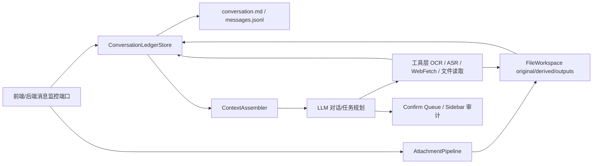

# 对话系统重构计划

## 目标结论

本次重构把系统主轴从“临时消息处理 + OCR fallback + 上下文拼接”改为“每个微信私聊/群聊一份持续追加的对话账本”。模型不再直接依赖窗口 OCR 来理解微信前端，而是读取结构化对话文件；文件、图片、语音、链接先进入隔离中间层并产出可引用的解析文本，再按消息顺序写回对话账本。

OCR 不再作为微信读取 fallback。OCR 只作为工具层能力，用于图片、文档内图片、语音主路径截图转文字等文件中间层处理。

## 新架构



## 对用户要求的逐项落实

### 1. OCR 去 fallback 化

改造项：

1. 停止把 `poll-ocr-window` 作为主对话输入路径继续扩展。
2. 保留现有 RapidOCR 项目内依赖 `vendor/ocr-python`，封装成工具层 `vision.ocr`。
3. OCR 工具只处理中间层文件路径，不直接读取微信窗口。
4. `preflight` 中将 OCR 从 `fallback_inputs` 移出，放到 `tools.ocr` 能力检查。

验收：

1. 图片附件解析通过 OCR 工具产出 `.md` 解析文件。
2. 对话系统不因 OCR 窗口截图生成新消息或回复候选。

### 2. 每个群聊/私聊独立对话文件

新增 `ConversationLedgerStore`：

```text
data/conversation_ledgers/<conversation_id>/
  state.json
  messages.jsonl
  conversation.md
  annotations/
  memory/
```

每条消息最少字段：

```json
{
  "entry_id": "stable id",
  "message_id": "normalized id",
  "conversation_id": "...",
  "conversation_type": "private|group",
  "chat_title": "...",
  "sender_name": "...",
  "sender_wechat_id": "...",
  "is_self": false,
  "received_at": "ISO time",
  "sequence": 1,
  "status": "active|removed|recalled",
  "text_blocks": [],
  "quote": {},
  "attachments": [],
  "links": [],
  "source": "frontend_monitor|backend_events|manual_test",
  "created_at": "ISO time",
  "updated_at": "ISO time"
}
```

对话文件渲染规则：

```markdown
## 000001 2026-06-29T15:20:00+08:00 PAGE

普通文本...

> Quote: ...

![image attachment]
[file:file_id name path]
```

撤回/删除规则：

1. JSONL 中原 entry 标记 `status=recalled` 或 `removed`。
2. `conversation.md` 重渲染时默认不显示 removed/recalled 正文，只保留审计占位。
3. 上下文装配器默认排除 removed/recalled。

引用规则：

1. 引用优先按 `message_id/entry_id` 索引。
2. 无 ID 时按 quote text 近似匹配最近消息。
3. 命中后把被引用文本块、邻近消息、关联文件索引注入上下文。

### 3. 文件中间层目录规范

沿用并扩展 `FileWorkspace`：

```text
data/file_workspace/<conversation_id>/<session_id>/<file_id>/
  manifest.json
  original/<原件>
  derived/
    analysis.json
    parse_result.json
    content.md
    chunks/
    media/
  outputs/
```

必须满足：

1. 所有文件先 copy 到 `original/`，不直接在微信文件夹动工。
2. 对话记录只写 `file_id`、manifest 路径、解析结果路径、可见摘要/文本块。
3. 原件路径和解析文件路径都留在 manifest 和 ledger attachment refs。
4. conversation/session 隔离。

### 4. 图片处理

流程：

1. 前端监控发现图片文件，copy 到 `original/`。
2. 调 OCR 工具读取。
3. OCR 结果写入 `derived/content.md`。
4. 若 OCR 文本不超过阈值，直接作为图片文本块写入 ledger。
5. 超过阈值，调用模型总结后写入 ledger，同时保留原 OCR 文件索引。
6. 表情包/无意义图片后续通过轻量分类器标记 `semantic_status=emoji_or_noise`，默认不触发任务。

### 5. 语音处理

主路径：

1. 优先调用微信自带语音转文字。
2. 通过前端/控件文本或截图 OCR 获取转文字结果。
3. 转录写入 `derived/transcript.md`，并作为语音文本块写入 ledger。

fallback：

1. 新增本地 ASR 工具接口，初期留空。
2. 当主路径失败时，调用本地 ASR 对中间层音频文件转录。
3. 依赖未安装时工具返回 `blocked`，并在计划中明确安装位置。

待定依赖：

1. 推荐后续安装 Whisper/Faster-Whisper 到 `vendor/asr-python`。
2. 当前不绕过，不伪造语音能力。

### 6. 文档处理

允许类型：

1. Word: `.docx`
2. PDF: `.pdf`
3. 表格: `.xlsx`, `.xlsm`, `.csv`
4. 文本: `.md`, `.txt`

拒绝：

1. 代码文件暂不接受。
2. PPT/视频暂不接受，直到专门处理路径完成。

预分析 `analysis.json`：

```json
{
  "file_type": "pdf",
  "estimated_tokens": 1234,
  "has_images": true,
  "has_tables": false,
  "has_audio": false,
  "external_links": [],
  "page_count": 12,
  "sheet_count": 0
}
```

处理规则：

1. Excel/CSV：解析成数组 JSON；超大表格分块写 `derived/chunks/table_*.json`，ledger 注入第一块和完整索引。
2. MD/TXT：文本直接注入；超长则分块总结，ledger 注入合并总结和原文索引。
3. Word/PDF 纯文本：同 MD/TXT。
4. Word/PDF 含图片/音频：先在文本中插占位符，再对媒体做 OCR/ASR，嵌回分块文本；超长则总结后注入 ledger。

### 7. 链接处理

新增 `web.fetch` 工具：

1. 识别普通消息和引用中的 URL。
2. 抓取网页文本，不做多媒体阅读。
3. 写入 `annotations/<entry_id>_<url_hash>.md`。
4. 回填 ledger 注释块。
5. 超长网页由模型总结后注入 ledger，并保留原文路径。

### 8. 上下文与任务启动

ContextAssembler 规则：

1. 读取 `conversation.md/messages.jsonl`，默认只取 active entry。
2. 按成熟聊天项目思路做窗口化：近期消息 + 被引用消息 + 当前任务相关文件/链接注释 + 长期记忆摘要。
3. 长期记忆分层：
   - `memory/summary.md`: 会话滚动摘要
   - `memory/preferences.json`: 用户偏好
   - `memory/entities.json`: 人名、项目、常用文件
4. 被引用消息强制注入。
5. 被撤回/删除消息不进入可见上下文。
6. 如果当前消息含文件/链接，必须等待相关解析 entry 写入 ledger 后才启动 LLM 对话或任务。

### 9. 群聊与私聊触发

私聊：

1. 持续激活。
2. 每条用户消息进入 ledger。
3. 非结束话题则可触发回复/任务。

群聊：

1. 全量记录 ledger。
2. 常态静默。
3. 只有被 @、明确命令、或引用 bot 时触发任务。
4. 未触发消息仍作为上下文记录。

### 10. 前端监控接口

目标不是 OCR 截屏，而是前端/后端监控端口提供结构化事件：

```json
{
  "event_type": "message|revoke|file|quote|self_message",
  "conversation_type": "private|group",
  "chat_title": "PAGE",
  "sender_name": "PAGE",
  "is_self": false,
  "text": "...",
  "quote": {},
  "attachments": [],
  "mentions": ["bot"],
  "observed_at": "..."
}
```

本轮先通过 `BackendEventJsonlDriver` 兼容模拟该接口，后续再接真实前端监控。

## 分阶段实施顺序

### Phase A：账本基础设施

1. 新增 `conversation/ledger.py`。
2. 支持 append message/reply、mark recalled、render markdown、quote lookup。
3. `MessageProcessor` 在旧 context_store 外同步写 ledger。
4. 测试覆盖顺序、引用、撤回、self 消息、附件索引。

### Phase B：文件处理管线升级

1. 扩展 `FileWorkspace` 写 `analysis.json/content.md/chunks`。
2. 新增 `AttachmentPipeline`，统一图片、文本、表格、pdf/docx 的解析状态。
3. OCR 工具化注册，图片解析不再直接从 driver 调 OCR。
4. 后端事件附件必须完成 stage/parse 后再写入 ledger。

### Phase C：ContextAssembler 替换旧上下文拼接

1. 从 ledger 构建 prompt snapshot。
2. 支持 token budget、引用强制注入、removed 排除、文件索引提示。
3. ConversationEngine 改读 ledger snapshot。
4. 旧 `ConversationContextStore` 降级为兼容层或迁移工具。

### Phase D：WebFetch 与注释回填

1. 新增 `web.fetch` 工具。
2. URL 识别与注释文件写入。
3. 注释回填 ledger。
4. 超长网页总结。

### Phase E：语音路径

1. 定义 ASR 工具接口。
2. 微信自带转文字主路径事件格式。
3. 本地 ASR fallback 留空并明确依赖安装。

### Phase F：前端监控端口

1. 设计 HTTP/local JSONL 事件协议。
2. 监控私聊/群聊消息、自己消息、引用、撤回、文件。
3. 与 ledger 和 attachment pipeline 对接。
4. 废除 OCR 对话采集 CLI 或标记为 debug-only。

## 本轮落地范围

本轮先完成：

1. 新计划书。
2. `ConversationLedgerStore` 基础模型与测试。
3. `MessageProcessor` 镜像写入 ledger。
4. OCR 工具注册雏形。
5. `preflight` 文案更新：OCR 不再是 fallback 输入。

暂不完成但明确保留：

1. 真实前端监控端口。
2. 本地 ASR 安装与实现。
3. Word/PDF 图片占位嵌回完整实现。
4. OpenAI 成熟 memory 架构的完整替换。

## 依赖策略

已存在：

1. OCR: `vendor/ocr-python`
2. LibreOffice: 当前通过 `LibreOfficeRuntime` 调用系统或 vendor `soffice`
3. PDF/Excel worker: Codex workspace bundled Python 或现有 worker

待安装：

1. ASR: 暂无，后续建议 `vendor/asr-python`
2. 高级 PDF 图像抽取: 如需要，可安装 PyMuPDF 到项目内依赖环境
3. 网页抓取: 可先用 Python 标准库/urllib + html parser，复杂页面后续再加 Playwright

不绕过原则：

1. 依赖不存在就返回 `blocked`。
2. 不假装完成 OCR/ASR/PDF 媒体解析。
3. 不在微信原始目录写入或破坏文件。
