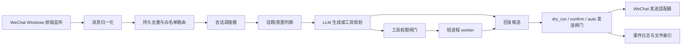

# 个人微信白名单 Agent 打造计划

## 当前地基检查结论

项目已经具备一个可测试的最小闭环：消息归一化、联系人/群白名单路由、群聊话题判断、LLM 回复、工具调用、事件日志、短进程 worker 队列和 replay 测试。这个方向是对的，尤其是默认 `dry_run` 与 `confirm` 模式，适合先把安全边界跑稳再接真实微信发送。

目前主要逻辑缺口如下：

1. 真实微信驱动仍是占位：`wechat_driver.fake` 只能 replay，`ReplyGate` 的 `auto` 发送也明确未实现。
2. 白名单只覆盖联系人与群名称，文件读取白名单还没有真正约束到工具层。
3. 群聊 `group_cooldown_seconds` 尚未执行；群名改动会导致白名单失效，需要别名或人工绑定机制。
4. 去重只存在内存中，重启后可能重复处理旧消息。
5. 对话并发目前主要体现在工具 worker 队列，聊天消息本身还没有“全局并发 + 单会话串行”的调度器。
6. LLM provider 路由已有雏形，但 DeepSeek 官方 API 根地址与模型别名需要显式配置，不能假设所有 OpenAI-compatible 服务都带 `/v1`。
7. 工具目前是假实现，后续接真实文档读取、翻译、检索时必须先有路径、大小、扩展名、输出目录和审计日志约束。
8. 日志默认保存原文，适合本地调试，但正式使用前需要可配置脱敏、保留周期和一键清理。

DeepSeek API 已按 2026-06-28 官方文档核对：OpenAI 格式 `base_url` 为 `https://api.deepseek.com`，可用模型包含 `deepseek-v4-flash` 与 `deepseek-v4-pro`；旧的 `deepseek-chat`、`deepseek-reasoner` 将于 2026-07-24 15:59 UTC 弃用。参考：[DeepSeek API Docs](https://api-docs.deepseek.com/)。

## 目标架构



核心原则：

1. 默认本地运行，默认不自动发送。
2. 白名单先行：联系人、群组、文件目录、工具能力都必须显式允许。
3. 单会话串行，全局有限并发，避免一个群聊刷屏或一个任务占满模型。
4. 工具 worker 短进程化，失败可重试，输出进入索引，路径不可越界。
5. 真实微信接入分阶段推进，先只读，再确认发送，最后才考虑 `auto`。

## 阶段 0：安全与配置基线

验收标准：

1. `init` 生成 DeepSeek v4 flash 的推荐 provider 配置，但没有 API key 和 `base_url` 时仍用 fake LLM。
2. 提供 `set-deepseek-provider` 命令，写入 `base_url=https://api.deepseek.com`、`model=deepseek-v4-flash`、`api_key_env=DEEPSEEK_API_KEY`。
3. 文件工具只允许读取 `file_read_roots` 里的文件，默认是 `data/inbox`。
4. 超出目录、文件不存在、扩展名不允许、文件过大时返回 `blocked`。
5. 单元测试覆盖上述边界。

## 阶段 1：消息入口与持久去重

验收标准：

1. 新增真实微信只读适配器接口实现，先不发送消息。
2. 将 `message_id` 或驱动原始 ID 持久化到 sqlite，重启后不重复处理。
3. 群白名单支持别名绑定与 rename 迁移命令。
4. 群聊冷却时间生效，同群短时间多条消息可合并上下文，但只出一条回复候选。

## 阶段 2：对话调度与并发

验收标准：

1. 引入消息调度器：每个 `conversation_id` 内串行处理，全局最多 N 个会话并行。
2. LLM provider 的 `max_concurrency`、`cooldown_seconds` 生效。
3. 工具 worker 与 LLM 调用分别限流，互不拖垮。
4. replay 支持批量消息并发回放，测试证明同会话顺序不乱。

## 阶段 3：工具与文件处理

验收标准：

1. `data/inbox` 作为默认人工投递区，支持通过文件索引或相对路径引用文件。
2. 文档读取、摘要、翻译、格式转换先支持 txt/md/docx/pdf，复杂格式逐步增加。
3. 输出统一进入 `data/tool_outputs` 并写入 `file_index.sqlite`。
4. 工具调用必须有审计日志，回复中只返回摘要与文件引用，不泄露本机绝对路径。

## 阶段 4：发送与本地部署

验收标准：

1. `confirm` 模式有本地确认队列，可查看候选回复、修改、发送或丢弃。
2. `auto` 模式仅允许白名单会话和低风险文本回复，文件发送仍需确认。
3. Windows 本地启动脚本、健康检查、日志目录和配置说明齐全。
4. 异常时自动降级为不发送，只保留候选回复与日志。

## 阶段 5：长期稳态

验收标准：

1. 日志支持脱敏、保留周期、按会话清理。
2. 配置有导入/导出与变更审计。
3. 模型 provider 可扩展为多模型：聊天、分类、摘要、工具规划分别选择。
4. 增加端到端演练脚本：白名单私聊、白名单群聊、非白名单忽略、文件越界阻断、工具成功、worker 超时重试。

## 当前推进顺序

本轮先推进阶段 0，因为它决定后续真实微信接入时是否会把风险放大。完成后再进入阶段 1 的真实只读驱动与持久去重。

## 已完成进展

2026-06-28 第一轮：

1. DeepSeek provider 默认配置与 `set-deepseek-provider` 命令已补齐。
2. 文件读取白名单已落到工具层，默认只允许 `data/inbox`。
3. 持久去重、群聊冷却、确认队列、错误隔离已接入。
4. `confirm` 模式会写入 `data/confirm_queue.jsonl`。
5. 回复生成失败不会把消息标记为已处理。

2026-06-28 第二轮：

1. 已抽出 `MessageProcessor`，统一承载归一化、路由、话题、冷却、回复和发送闸门。
2. 已新增 `PollingRunner` 与 `poll-fake` CLI，为真实微信只读驱动预留运行入口。
3. 已新增 `ConversationScheduler` 骨架，实现同一会话串行、不同会话全局有限并发。
4. 当前测试基线：38 个单元测试通过，`replay` 与 `poll-fake` CLI smoke 通过。

2026-06-28 第三轮：

1. 已新增 `WindowsWeChatReadOnlyDriver`，只做窗口探测与只读快照解析，明确不发送消息。
2. 已新增 `wechat-health` CLI，可枚举标题包含“微信”或“WeChat”的可见窗口。
3. 已新增 `poll-snapshot` CLI，可用文本快照走完整白名单、调度、回复闸门管线。
4. 当前测试基线：45 个单元测试通过，`wechat-health` 与 `poll-snapshot` CLI smoke 通过。

2026-06-28 第四轮：

1. 已新增 `SnapshotProvider` 抽象，快照来源从 driver 中解耦。
2. 已新增 `FileSnapshotProvider` 与 `WindowsClipboardSnapshotProvider`。
3. 已新增 `poll-clipboard` CLI，可读取用户主动复制到剪贴板里的文本快照。
4. 剪贴板 provider 只读 Unicode 文本，不写剪贴板，不点击微信，不发送消息。
5. 当前测试基线：49 个单元测试通过，1 个非 Windows 剪贴板分支跳过，`poll-snapshot` 与 `poll-clipboard` CLI smoke 通过。

当前快照格式：

```text
[private] 聊天标题 | 发言人 | wxid_optional | 消息文本
[group] 群标题 | 发言人 | wxid_optional | 消息文本
```

示例：

```text
[private] 小明 | 小明 | wxid_xiaoming | 今天复习得有点累
[group] 学习群 | 小刚 | wxid_xiaogang | 我们继续聊 AI
```

命令示例：

```powershell
python -m app.personal_wechat_bot.main wechat-health
python -m app.personal_wechat_bot.main --data-dir data poll-snapshot .\tests\fixtures\messages\windows_snapshot.txt --loops 1 --interval 0
python -m app.personal_wechat_bot.main --data-dir data poll-clipboard --loops 1 --interval 0
```

剪贴板模式使用方式：

1. 在微信里手工复制一段你整理成上述快照格式的文本。
2. 运行 `poll-clipboard`。
3. 程序会按白名单处理剪贴板文本；未命中白名单、格式不匹配或剪贴板为空时不会生成回复。

2026-06-28 第五轮：

1. 已新增 `WindowsUIAutomationSnapshotProvider`，用于只读采集 Windows UI Automation 控件树文本。
2. 已新增 `wechat-snapshot` CLI，可打印或保存当前 UIA 文本快照。
3. 该层只做观察：不点击、不聚焦、不输入、不发送，也不会把 UIA 文本直接当消息处理。
4. 当前测试基线：52 个单元测试通过，1 个非 Windows 剪贴板分支跳过；`wechat-snapshot` CLI smoke 通过并安全返回 `empty`。

UIA 快照命令示例：

```powershell
python -m app.personal_wechat_bot.main wechat-snapshot --max-nodes 200
python -m app.personal_wechat_bot.main wechat-snapshot --max-nodes 200 --output .\data\wechat_uia_snapshot.txt
```

下一步需要在真实微信窗口打开时运行 `wechat-snapshot`，根据输出里的控件文本形态设计从 UIA 文本到 `[private]` / `[group]` 快照格式的转换规则。

2026-06-28 第六轮：

1. 已新增 `ApiKeyPool`，支持主 key 环境变量、环境变量池、以及本地 key 引用文件。
2. 已新增 `ConversationKeyAssigner`，为后续“私聊 1 key、群聊 2 key”的 conversation sticky 分配打基础。
3. `RelayOpenAIClient` 已改为通过 key pool 取 key；没有 key 池时仍兼容原 `api_key_env`。
4. `preflight` 已展示 key 引用、来源、可用状态、池大小，但不会输出真实 key。
5. `.gitignore` 已忽略 `.env`、`API key.md`、`API keys.md`。
6. 当前测试基线：61 个单元测试通过，1 个非 Windows 剪贴板分支跳过。

`API key.md` 推荐只存环境变量名，不存真实 key：

```text
# DeepSeek key refs
DEEPSEEK_KEY_01
DEEPSEEK_KEY_02
DEEPSEEK_KEY_03
```

真实 key 放在 `.env` 或系统环境变量：

```powershell
$env:DEEPSEEK_KEY_01="sk-..."
$env:DEEPSEEK_KEY_02="sk-..."
```

随后在 `data/config.json` 的 chat provider 中配置：

```json
{
  "api_key_env_pool": ["DEEPSEEK_KEY_01", "DEEPSEEK_KEY_02"],
  "api_key_file": "API key.md"
}
```

2026-06-28 第七轮：

1. 已在本机真实测试号环境中确认 `wechat-health` 能发现 Windows 微信窗口。
2. 已支持 `.env/API key.md` 直接存放 key 本体；程序只在内存使用，preflight 只显示匿名指纹和可用数量。
3. 当前 `data/config.json` 已切到 DeepSeek `deepseek-v4-flash`，并指向 `.env/API key.md`。
4. 已将私聊白名单扩展为支持 `wxid`、发送者名、聊天标题三种匹配，便于 PAGE 真实测试。
5. 已将 `PAGE` 加入白名单。
6. 已新增 `poll-snapshot --verbose`，可以直接查看处理结果和候选回复。
7. 已用 PAGE 快照完成真实 DeepSeek dry-run 链路测试：路由命中、回复候选生成、发送保持 `skipped/dry_run`。

2026-06-28 第八轮：

1. 已增强 `wechat-health`，现在会同时报告可见微信窗口、微信进程、当前前台窗口。
2. 当前设备检测到多个 `WeChatAppEx` 进程，但没有可见微信主窗口句柄，状态为 `process_only`。
3. 当前前台窗口不是微信，因此 `wechat-snapshot` 暂时读不到 PAGE 对话文本。
4. 已尝试 .NET UIAutomation 与 Win32 hwnd 路径，均保持只读、不点击、不输入、不发送。
5. 当前测试基线：64 个单元测试通过，1 个非 Windows 剪贴板分支跳过。

继续真实窗口读取前，需要把 Windows 微信主窗口打开到桌面，并切换到 PAGE 聊天窗口，然后运行：

```powershell
python -m app.personal_wechat_bot.main wechat-health
python -m app.personal_wechat_bot.main wechat-snapshot --max-nodes 200 --output .\data\wechat_uia_snapshot.txt
```

2026-06-28 第九轮：

1. 已确认微信窗口可截图捕获，截图中可见 PAGE 对话内容。
2. 当前 UIA 文本仍为空，因此真实窗口读取暂时走“窗口截图可见 + 手工快照桥”的过渡路径。
3. 已用 PAGE 真实对话内容生成 dry-run 候选回复，发送保持 `skipped/dry_run`。
4. 已收紧聊天 prompt，发给对方的 `reply.text` 不再包含计划/监控/总结。
5. 已新增回复清理测试，当前测试基线：65 个单元测试通过，1 个非 Windows 剪贴板分支跳过。

当前可以开始候选对话：

```text
PAGE: 那我们现在可以开始聊天了吗？
候选回复: 哈哈，当然可以呀，聊啥都行，你带话题吧~
```

在发送模块实现前，需要人工复制候选回复到微信。

2026-06-28 第十轮：

1. 已新增 `Win32WindowCapture`，可直接保存微信窗口截图到 `data/wechat_window.bmp`。
2. 已新增 `wechat-capture` CLI，当前已成功捕获 PAGE 微信窗口。
3. 已新增 OCR 抽象 `PlaceholderGpuOcrEngine` 与 `capabilities` CLI。
4. 已新增 `LibreOfficeRuntime` 健康检查与 PDF 转换封装。
5. 当前设备 GPU 可用：NVIDIA RTX 5080 Laptop GPU；OCR Python 后端尚未安装。
6. 当前设备未发现 `soffice` / `libreoffice` / `tesseract`。
7. 当前测试基线：68 个单元测试通过，1 个非 Windows 剪贴板分支跳过。

能力检查命令：

```powershell
python -m app.personal_wechat_bot.main capabilities
python -m app.personal_wechat_bot.main wechat-capture --output .\data\wechat_window.bmp
```

后续安装建议：

1. OCR 优先路线：GPU 版 PaddleOCR 或 EasyOCR，安装后接入 `OcrEngine`。
2. 文档处理路线：安装 LibreOffice，并确保 `soffice` 在 PATH 中。
3. 如果只做临时中文 OCR，也可以安装 Tesseract + 中文语言包，但长期效果不如专门 OCR 引擎。

2026-06-28 第十一轮：

1. 已创建项目内 OCR 虚拟环境 `vendor/ocr-python`，不污染系统 Python。
2. 已安装 `rapidocr-onnxruntime`、`onnxruntime-gpu`、`opencv-python`、`Pillow`、`numpy`。
3. 已新增 `RapidOcrSubprocessEngine`，通过子进程调用项目内 OCR 环境。
4. 已新增 `ocr-image`、`ocr-snapshot`、`poll-ocr-window` CLI。
5. 已从真实微信窗口截图中 OCR 出 PAGE 对话文本，并转换为标准快照。
6. 已完成真实链路：微信窗口截图 -> OCR -> 快照 -> 白名单路由 -> DeepSeek dry-run 候选回复。
7. 生成候选回复示例：`嘿，你好呀！终于加上啦～`
8. 当前发送仍保持 `skipped/dry_run`。
9. 当前测试基线：69 个单元测试通过，1 个非 Windows 剪贴板分支跳过。

真实 OCR 对话候选命令：

```powershell
python -m app.personal_wechat_bot.main --data-dir data poll-ocr-window --chat-title PAGE --verbose
```

2026-06-28 第十二轮：

1. 已新增 `OcrWindowPollingRunner`，将微信窗口截图、OCR、快照转换、消息处理串成可轮询 runner。
2. `poll-ocr-window` 已支持 `--loops` 与 `--interval`。
3. runner 内置快照去重，同一屏幕内容不会在连续轮询中重复触发。
4. 已完成真实两轮 smoke：第一轮生成候选回复，第二轮返回 `unchanged`，`processed_count=1`。
5. 当前测试基线：70 个单元测试通过，1 个非 Windows 剪贴板分支跳过。

轮询命令示例：

```powershell
python -m app.personal_wechat_bot.main --data-dir data poll-ocr-window --chat-title PAGE --loops 20 --interval 2 --verbose
```

2026-06-28 第十三轮：

1. 已将 OCR 快照解析器从“取最后一条长文本”升级为“清洗 UI 噪声 -> 猜测会话标题 -> 切分候选消息块 -> 选择最新有效消息”。
2. 已新增 `OcrSnapshotParseResult` 与 `parse_ocr_snapshot`，同时保留 `ocr_text_to_snapshot` 作为 CLI 和 runner 的兼容入口。
3. 已过滤真实 PAGE 窗口中出现的搜索栏、文件传输助手、时间、重复聊天标题、自身昵称、单字 OCR 误识别等噪声。
4. 已处理截断重复文本：当 OCR 同时识别到“我通过了你的朋友验证请求，”和完整句时，优先保留完整句。
5. 已补充 OCR 解析回归测试：真实 PAGE 样本、截断重复、底部单字噪声、自动猜标题、空消息、额外忽略昵称。
6. 已完成真实两轮 OCR 轮询 smoke：解析结果为 `[private] PAGE | PAGE |  | 我通过了你的朋友验证请求，现在我们可以开始聊天了`，第二轮返回 `unchanged`，`processed_count=1`。
7. 当前发送仍保持 `skipped/dry_run`，不会触发真实微信发送。
8. 当前测试基线：75 个单元测试通过，1 个非 Windows 剪贴板分支跳过；`compileall` 通过。

2026-06-28 第十四轮：

1. 已将项目主输入方向调整为后台端优先，窗口 OCR 明确降级为 fallback 读屏路径。
2. 已新增 `BackendEventJsonlDriver`，从本地后台事件 JSONL 读取消息并输出标准 `RawWeChatMessage`，后续白名单、路由、调度、DeepSeek、dry-run 复用原链路。
3. 已新增 `append-backend-event` 与 `poll-backend-events` CLI，可手动写入后台消息事件并消费。
4. 后台事件支持附件路径；附件会先经过 `file_read_roots`、允许扩展名、最大大小校验，再登记进 `file_index.sqlite`。
5. 已新增 `BackendFileWatcher` 与 `scan-backend-files` CLI，可扫描受控目录中新文件并自动追加为后台事件。
6. 当前默认和真实配置均允许 `.txt`、`.md`、`.docx`、`.pdf` 与常见图片扩展 `.png`、`.jpg`、`.jpeg`、`.bmp`、`.webp`；视频、PPT、代码文件仍未放入默认处理范围。
7. `preflight` 已区分 `primary_inputs` 与 `fallback_inputs`：后台事件与快照为主路径，`poll-ocr-window` 为 fallback。
8. 已完成真实本地 smoke：`scan-backend-files` 发现 `data/inbox/page_snapshot.txt`，`poll-backend-events` 命中 PAGE 白名单并生成 DeepSeek dry-run 候选回复，发送保持 `skipped/dry_run`。
9. 当前测试基线：83 个单元测试通过，1 个非 Windows 剪贴板分支跳过；`compileall` 通过。

后台端主线命令示例：

```powershell
python -m app.personal_wechat_bot.main --data-dir data scan-backend-files --chat-title PAGE --sender-name PAGE
python -m app.personal_wechat_bot.main --data-dir data poll-backend-events --loops 1 --interval 0 --verbose
```

2026-06-28 第十五轮：

1. 已新增 `BackendAttachmentParser`，后台附件不再只登记文件名，而会尝试提取可读内容预览。
2. `.txt` 与 `.md` 附件会直接读取文本预览，并清理 UTF-8 BOM 与空行。
3. `.docx` 附件会用无外部依赖的 ZIP/XML 路径提取正文段落预览。
4. 常见图片附件 `.png`、`.jpg`、`.jpeg`、`.bmp`、`.webp` 会调用 OCR 引擎读取图片文字；单元测试中用假 OCR 隔离，真实运行默认走项目内 RapidOCR。
5. `.pdf` 当前只登记并返回“待接入 PDF 文本抽取”，避免先用不可靠方式误读正文。
6. 后台事件生成的消息正文现在会包含 `[后台附件解析]` 与 `[后台附件内容]`，使后续 DeepSeek dry-run 能基于附件内容接话或规划任务。
7. 已完成真实本地 smoke：`backend_parse_smoke.txt` 被后台事件读取，附件内容进入消息上下文并生成候选回复；发送保持 `skipped/dry_run`。
8. 当前测试基线：89 个单元测试通过，1 个非 Windows 剪贴板分支跳过；`compileall` 通过。

2026-06-29 第十六轮：

1. 已确认微信 4.x 本机文件存储根位于 `E:\aab通讯文件存储\xwechat_files`，真实上传文件可从该目录下账号 `msg\file`、`cache\Message` 等路径扫描。
2. 已新增 `scripts/attachment_extract_worker.py`，通过 Codex 打包 Python 子进程调用 `pdfminer/pypdf/openpyxl` 等依赖，不污染系统 Python。
3. `BackendAttachmentParser` 已支持 PDF 正文抽取、`.xlsx/.xlsm/.csv` 表格预览抽取，并继续支持图片 OCR。
4. `scan-backend-files` 已支持 `--root`、`--recursive`、`--since-minutes`、`--max-files`，用于实机扫描微信目录时限时限量，避免扫入历史文件。
5. `poll-backend-events` 已支持 `--extra-root`，可在单次实机读取时临时授权微信文件目录，不永久扩大 `file_read_roots`。
6. 已修复并发扫描同一文件时可能重复追加事件的问题，改为先原子登记 fingerprint。
7. 已小幅增强聊天 prompt：当用户要求发送/转述/读取附件内容时，DeepSeek 会按文件列出可见内容，而不是只说“我看到了”。
8. 已完成 PAGE 上传实机链路：识别并解析 `Checklist.pdf`、Admission Offer 图片、`cross_border_cost_time_distribution_seed.csv`；DeepSeek 生成了可发给 PAGE 的 dry-run 内容，发送仍保持 `skipped/dry_run`。
9. 当前测试基线：92 个单元测试通过，1 个非 Windows 剪贴板分支跳过；`compileall` 通过。

实机文件扫描命令示例：

```powershell
python -m app.personal_wechat_bot.main --data-dir data scan-backend-files --event-file data\wechat_upload_smoke.jsonl --root "E:\aab通讯文件存储\xwechat_files\wxid_p2ru43eyxtk322_adfb\msg\file\2026-06" --chat-title PAGE --sender-name PAGE --recursive --since-minutes 240 --max-files 5
python -m app.personal_wechat_bot.main --data-dir data poll-backend-events --event-file data\wechat_upload_smoke.jsonl --extra-root "E:\aab通讯文件存储\xwechat_files" --loops 1 --interval 0 --verbose
```

## 测试微信号容器建议

可以使用新注册的微信号作为测试与未来项目容器，这比直接使用主力号更安全。建议把它视为“受控测试容器”，而不是一开始就作为自动运营账号：

1. 前期只登录 Windows 微信客户端，不启用任何自动发送能力。
2. 本项目当前真实发送仍未实现，`dry_run` 和 `confirm` 都不会触发微信发送。
3. 测试阶段只添加少量白名单联系人或测试群，先验证读取、路由、回复候选和确认队列。
4. 新号不要短时间高频收发、批量加好友、批量入群或发送重复内容。
5. 不把主力号聊天记录、敏感文件目录、浏览器 Cookie、密钥文件放进 `file_read_roots`。
6. DeepSeek API key 只放在环境变量里，不写进配置文件。
7. 每次登录新号前先运行预检：

```powershell
python -m app.personal_wechat_bot.main --data-dir data preflight --show-whitelist
```

预检重点看：

1. `send_policy.send_enabled` 必须是 `false`。
2. `send_policy.real_send_implemented` 必须是 `false`，直到你明确决定进入发送阶段。
3. `wechat_access.read_only` 必须是 `true`。
4. `mode` 建议保持 `dry_run`。
5. 白名单数量应符合预期。

2026-06-29 第十七轮：

1. 已新增 `FileWorkspace` 中间层：所有后台附件先复制到 `data/file_workspace/<conversation_id>/<session_id>/<file_id>/original/`，再在隔离目录内解析，不直接在微信文件目录内动工。
2. 每个文件工作区写入 `manifest.json`，记录 `original_path`、`staged_path`、`sha256`、conversation/session、`derived_dir`、`outputs_dir`，用于索引、断点续读和后续工具回放。
3. 附件解析结果写入 `derived/parse_result.json` 与 `derived/preview.txt`；再次处理同一 staged 文件时优先复用缓存，避免重复 OCR/文档解析和重复推理。
4. 已预留 `outputs/libreoffice/` 路径和 `libreoffice_convert_to_pdf` 中间层接口，后续 LibreOffice 全量环境可在 file workspace 内输出 PDF 或派生文件。
5. 已新增 `ConversationContextStore`：按 conversation/session 记录近期消息、后台附件、解析内容、工具结果；默认 session 为 `session_default`。
6. 已支持“清空当前对话上下文”命令切换新 session；历史微信记录不删除，后续可通过工具或 workspace manifest 回捞。
7. Prompt 构建已接入混合上下文快照，包含近期消息、文件解析产物、工作区引用、任务记录和轻量上下文分析；模型看到的是解析产物与索引，不需要也不应该直接访问微信原始文件。
8. 近期消息上下文会剥离 `[后台附件内容]` 大段正文，避免文件内容在 prompt 中重复出现；文件正文统一在“本 session 文件与解析产物”区提供。
9. 已清理 dry-run 测试桩外显文本，候选回复不再暴露 `PLAN/MONITOR/SUMMARY` 内部标记。
10. 当前验证基线：99 个单元测试通过，1 个非 Windows 剪贴板分支跳过；`compileall` 通过；临时 CLI smoke 已确认 backend event -> file_workspace staging -> derived parse -> mixed context -> dry-run reply 链路跑通。

2026-06-29 第十八轮：

1. 已从 The Document Foundation 官方下载 LibreOffice Windows x86-64 MSI：`vendor/downloads/LibreOffice_26.2.4_Win_x86-64.msi`。
2. 已通过 MSI administrative extraction 解包到项目内：`vendor/libreoffice/`，核心可执行文件为 `vendor/libreoffice/program/soffice.exe`。
3. 已更新 `LibreOfficeRuntime`：优先发现项目内 `vendor/libreoffice/program/soffice.exe`，再回退系统 PATH；不污染系统 PATH。
4. 项目内 LibreOffice 健康检查改为读取 `program/version.ini` 快速确认 vendor 解包版，避免 `soffice --version` 在 Windows 上偶发慢启动/无输出导致误报。
5. `convert_to_pdf` 已固定工作目录到 LibreOffice `program`，并加入 `--headless --nologo --nofirststartwizard`，便于中间层稳定调用。
6. 已完成转换 smoke：临时 `.txt` 经项目内 LibreOffice headless 成功转换为 PDF。
7. `capabilities` 与 `preflight` 现均显示 LibreOffice `available=true`，executable 指向 `E:\chatbot-win\vendor\libreoffice\program\soffice.exe`。
8. 当前验证基线：100 个单元测试通过，1 个非 Windows 剪贴板分支跳过；`compileall` 通过。

2026-06-29 第十九轮：

1. 已修正 LibreOffice headless 调用的终端交互问题：`convert_to_pdf` 现在显式使用 `stdin=subprocess.DEVNULL`，不会继承当前终端输入，也不会等待用户按 Enter。
2. 已为 LibreOffice 子进程加入 `CREATE_NO_WINDOW`，避免 Windows 下弹出额外控制台窗口。
3. 已补充非交互参数：`--headless`、`--invisible`、`--nologo`、`--nodefault`、`--nofirststartwizard`、`--nolockcheck`、`--norestore`。
4. 每次转换都会在输出目录创建独立 `profile/`，并通过 `-env:UserInstallation=file:///...` 指定，避免复用用户全局 LibreOffice profile、恢复提示或锁文件状态。
5. 已新增 `tests/test_libreoffice_runtime.py`，覆盖非交互命令参数、独立 profile、关闭 stdin 和隐藏窗口行为。
6. 已完成真实转换 smoke：临时 `.txt` 静默转换为 PDF，输出目录包含独立 `profile/`，转换后无 `soffice` 残留进程。
7. 当前验证基线：102 个单元测试通过，1 个非 Windows 剪贴板分支跳过；`compileall` 通过；`capabilities` 继续显示 LibreOffice `available=true`。

2026-06-29 第二十轮：

1. 已审计中间层链路，发现并修复一个关键逻辑问题：此前 `BackendEventJsonlDriver` 会在路由/白名单判断前解析附件，非白名单消息理论上也会触发文件读取与 staging。
2. 后端附件入口改为两阶段：driver 初读时只生成 `[后台附件待处理]` 与 pending 元数据；`MessageProcessor` 在 route=`process` 后才调用 `enrich_message_attachments` 执行校验、复制、解析和上下文注入。
3. 非白名单联系人/群组现在不会触发 `file_workspace` 中的 manifest/original/derived 文件生成；已用 CLI smoke 验证。
4. 清空上下文命令的执行顺序已调整：先切换 session，再处理附件；因此“清空当前对话上下文”消息携带的附件会落入新 session，而不是旧 session。
5. enrichment 后会同时标记 pending 原始 message_id 与 enriched message_id 为 done，避免重启后重复处理同一后台事件。
6. `FileWorkspace` 已增强 manifest：保留 `sources` 多来源记录、`suffix`、session `index.json`，支持同内容不同来源/文件名的关联回放。
7. `staged_from_manifest` 已加入 workspace 边界校验，拒绝 manifest 内路径逃逸到 `data/file_workspace` 之外。
8. 解析缓存已加入 staged suffix 校验，避免同 hash 但文件扩展语义变化时复用错误解析结果。
9. 已新增/更新测试覆盖：pending/enrich 两阶段、非白名单不 staging、白名单后 staging、清空上下文附件落入新 session、多来源 manifest、manifest 越界拒绝、解析缓存 suffix 校验。
10. 当前验证基线：108 个单元测试通过，1 个非 Windows 剪贴板分支跳过；`compileall` 通过；`preflight` 仍为 dry_run 且真实发送禁用。

2026-06-29 第二十一轮：

1. 已完成打造计划残留审计：历史轮次中仍保留了若干过期事实，例如“OCR Python 后端尚未安装”、“未发现 LibreOffice”、“PDF 待接入抽取”、“手工快照桥”等；这些内容作为 dated history 保留，不直接改写历史记录。
2. 已新增 `audit-plan` CLI，用当前 `preflight` 真值覆盖历史残留判断：当前主输入为后台事件/快照，OCR 窗口轮询是 fallback；RapidOCR 可用且 GPU 可见；LibreOffice 使用项目内 `vendor/libreoffice/program/soffice.exe`；真实微信发送仍禁用。
3. 已新增 `cleanup-artifacts` CLI，默认 dry-run，只列出可清理的 smoke 产物，不删除任何文件；需要显式 `--apply` 才会删除白名单内候选。
4. 当前可清理候选限于可复现 smoke 证据：`data/wechat_window.bmp`、`data/wechat_uia_snapshot.txt`、`data/wechat_upload_smoke.jsonl`、`data/wechat_combo_content_test.jsonl`、`data/inbox/backend_parse_smoke.txt`、`data/inbox/page_snapshot.txt`。
5. 明确保留运行状态与证据账本：`config.json`、白名单、topic/search 配置、`logs.jsonl`、默认 `backend_events.jsonl`、各类 sqlite 去重/索引/冷却文件，以及 `data/file_workspace` 中间层内容；这些不进入自动清理范围。
6. 残留处理顺序固定为：先运行 `audit-plan` 获取当前真值和历史残留；再运行 `cleanup-artifacts` 审阅候选；确认无用后才运行 `cleanup-artifacts --apply`；随后继续 backend-first 文件/上下文链路开发；真实发送阶段保持最后处理。
7. 已补充 `tests/test_audit_cleanup.py`，覆盖计划残留识别、安全真值、清理 dry-run 不删除、`--apply` 只删除已知 smoke 文件且不碰日志/未知文件。
8. 快速验证已通过：新增单元测试通过；`audit-plan` 当前识别 8 条历史残留、6 个可清理 smoke 候选；`cleanup-artifacts` dry-run 未删除真实数据。

常用残留检查命令：

```powershell
python -m app.personal_wechat_bot.main --data-dir data audit-plan
python -m app.personal_wechat_bot.main --data-dir data cleanup-artifacts
```

2026-06-29 第二十二轮：

1. 按计划继续推进 backend-first 上下文能力，已新增引用消息上下文支持：后端事件可以携带 `quote` 元数据，模型生成前会尝试定位被引用消息并注入邻近消息窗口。
2. `append-backend-event` 已新增 `--quote-text`、`--quote-message-id`、`--quote-sender-name`、`--quote-received-at`，方便用 JSONL 后端事件模拟微信“回复/引用”消息。
3. `BackendEventJsonlDriver` 已支持读取并保留 quote 结构；非空 quote 会进入 `NormalizedMessage.metadata`，空 quote 不会触发引用上下文。
4. `ConversationContextStore` 已在消息事件中保存 quote，并在 `build_snapshot` 时按“message_id 精确匹配优先，引用文本片段匹配兜底”的规则查找历史消息。
5. 引用命中后会把被引用消息前后邻近消息、以及邻近窗口内的附件解析引用一起加入 prompt 的“引用消息上下文”区；这对应此前设计里的“对话+引用需要索引到引用内容附近并阅读相邻几条消息，包括文件”。
6. 该能力仍完全停留在后端上下文层，不触发真实微信发送，也不直接访问微信原始文件；文件内容仍来自中间层解析产物和 workspace 引用。
7. 已补充测试覆盖：引用按 message_id 命中、按文本片段命中、邻近消息和附件引用进入 prompt、空 quote 不生成引用上下文、后端事件保留 quote、CLI quote 参数写入 JSONL。
8. 快速 CLI smoke 已跑通：临时数据目录内两条 PAGE 后端事件，第二条引用第一条，`poll-backend-events --verbose` 能处理两条消息，发送仍为 `skipped/dry_run`。

引用消息模拟命令示例：

```powershell
python -m app.personal_wechat_bot.main --data-dir data append-backend-event --chat-title PAGE --sender-name PAGE --text "引用这条继续处理" --quote-text "被引用内容片段" --quote-sender-name PAGE
python -m app.personal_wechat_bot.main --data-dir data poll-backend-events --loops 1 --interval 0 --verbose
```

2026-06-29 第二十三轮：

1. 已按新设计去除 PAGE 特例与白名单准入依赖：PAGE 只保留为测试对象，不再是独立通道；系统现在按任意 `conversation_id` 自动建立会话通道。
2. 已新增 `ConversationChannelStore`：每个新私聊或群聊第一次出现时，会在 `data/conversation_channels/<conversation_id>/channel.json` 注册独立 channel，并写入 `index.json` 便于审计。
3. 通道记录包含：conversation 类型、聊天标题、状态、API key refs、key slots、sender 记录、后端目录、上下文目录、文件中间层目录、创建/更新时间。
4. API key 分配策略已落到持久层：私聊默认 1 个 key slot，群聊默认 2 个 key slot；同一 conversation sticky 复用分配，群聊请求会在已分配 key refs 间轮换。
5. `Router` 已从“白名单命中才处理”改为“非自身消息 + 去重后自动接入 channel”：私聊直接进入处理；群聊进入处理后仍走话题/静默决策，不会因为自动接入而无条件发言。
6. `preflight` 已标注 `whitelist.mode=legacy_not_used_for_routing`，并新增 `conversation_channels` 区展示自动注册策略、key slot、隔离目录规则；旧白名单文件暂留为兼容数据，不再作为准入边界。
7. `RelayOpenAIClient` 已接入 channel store：生成回复和群聊话题分类时优先按 conversation channel 取 key；没有 channel 或没有可用 key 时才回退默认 key。
8. 文件/上下文隔离继续沿用此前边界：`conversation_context/<conversation_id>/sessions/<session_id>` 与 `file_workspace/<conversation_id>/<session_id>/<file_id>`；channel 层新增 `backend` 目录用于后续后端数据层按 conversation 分区。
9. 并发处理侧已修复 Windows 下多个会话同时注册 channel 时写 `index.json.tmp` 撞锁的问题：`ConversationChannelStore` 现在使用线程锁与唯一临时文件名，适配 `PollingRunner` 的多 conversation 调度。
10. 已补充测试覆盖：私聊通道 1 key、群聊通道 2 key、key 轮换、并发通道注册、未知私聊/群聊自动接入、旧白名单不再拦截、后端附件在未知联系人中仍进入隔离 workspace、preflight 展示新策略。
11. 快速 CLI smoke 已确认：未知私聊和未知群聊都可自动生成 conversation channel；真实发送仍保持 `skipped/dry_run` 或群聊静默，不触发微信发送。

通道策略检查命令：

```powershell
python -m app.personal_wechat_bot.main --data-dir data preflight
python -m app.personal_wechat_bot.main --data-dir data poll-backend-events --loops 1 --interval 0 --verbose
```

2026-06-29 第二十四轮：

1. 已开始正式发送前核验，但没有开启真实发送；当前核验结论是：基础读取、通道隔离、DeepSeek key、OCR、LibreOffice 均可用，真实微信发送仍处于阻塞状态。
2. 已审计发送路径：`ReplyGate` 在 `dry_run` 下只返回 `skipped/dry_run`，在 `confirm` 下只写入 `confirm_queue.jsonl`，在 `auto` 下仍返回 `failed/real sending not implemented`；当前没有任何 driver 会真实发送微信消息。
3. 已确认现有 drivers 均为只读/失败发送桩：`BackendEventJsonlDriver`、`FakeWeChatDriver`、`WindowsWeChatReadOnlyDriver` 的 `send_message` 都不会写入微信。
4. 已新增 `send-readiness` CLI，作为正式发送前机器化检查入口；它会汇总 send policy、微信访问、conversation channel、模型 key，并列出 blockers/warnings/rollout 建议。
5. 当前 `send-readiness` 状态为 `blocked`，阻塞项为：真实发送驱动未实现、`send_enabled=false`、当前微信访问只读、send driver 名称为 `not_implemented`。
6. 当前通过项为：`dry_run` 活跃、模型 key 可用（3 个）、conversation channels 可自动注册私聊和群聊；警告项为尚未进入 `confirm` 试运行模式。
7. 正式发送前建议顺序：继续 dry-run 验证真实输入；实现显式 feature flag 保护的真实发送驱动；先进入 `confirm` 模式并由人工审核确认队列；仅选择一个私聊低频试发；最后才考虑 auto。
8. 已补充 `tests/test_send_readiness.py`，确保当前状态不会误报 ready，并验证 CLI JSON 输出。

发送前核验命令：

```powershell
python -m app.personal_wechat_bot.main --data-dir data send-readiness
python -m app.personal_wechat_bot.main --data-dir data preflight --show-whitelist
```

2026-06-29 第二十五轮：

1. 已新增发送控制配置字段：`send_enabled`、`send_driver`、`send_confirm_required`、`send_max_chars`、`send_min_interval_seconds`；默认仍为真实发送关闭、driver 未实现、需要确认、单条回复 800 字上限、最小间隔 5 秒。
2. 已新增 `GuardedSendExecutor`：即使队列项已被人工批准，也必须同时满足 `send_enabled=true`、`send_driver` 已配置、真实 driver 存在、文本非空、长度不超限，才会调用 driver 的 `send_message`。
3. 已扩展 `ConfirmQueue`：支持按状态查询、按 queue_id 获取、人工批准、人工拒绝、记录发送成功/失败；并加入合法状态流转保护，`sent`、`failed`、`rejected` 等终态不会被重新拉回批准状态。
4. 已新增发送控制命令：`set-send-controls`、`confirm-list`、`confirm-approve`、`confirm-reject`、`confirm-send-approved`，用于后续 confirm 模式下人工审核和逐条放行。
5. 当前 `confirm-send-approved` 在真实 `data` 下仍会被阻塞：因为 `send_enabled=false` 且 `send_driver=not_implemented`；它会把尝试结果写回确认队列，但不会触发微信发送。
6. 已新增发送 driver factory/注册表：只有注册表中真实存在的 driver 才会被 `preflight` 判定为 `real_send_implemented=true`；手动填入未知 driver 名称不会绕过 readiness。
7. 已修正 `send-readiness` 残留文案：现在不再把“新增 feature flag”列为下一步，而是明确要求在真实 driver 完成并通过 confirm 试运行前保持 `send_enabled=false`。
8. 已补充测试覆盖：确认队列批准/拒绝/终态保护、发送总闸关闭拦截、启用假 driver 后可调用、未知 driver 不会误报实现、控制命令持久化配置、CLI 审批与发送批准项的 blocked/failed 行为。
9. 当前验证基线：`python -m unittest discover -s tests` 通过，134 个测试通过、1 个跳过；`compileall` 通过；`send-readiness` 在真实 `data` 下仍为 `blocked`，阻塞项为真实发送 driver 未实现、`send_enabled=false`、微信访问只读、send driver 名称为 `not_implemented`。

发送控制命令示例：

```powershell
python -m app.personal_wechat_bot.main --data-dir data set-send-controls --disable
python -m app.personal_wechat_bot.main --data-dir data confirm-list
python -m app.personal_wechat_bot.main --data-dir data confirm-approve "<queue_id>" --reviewer local_user --note "ok"
python -m app.personal_wechat_bot.main --data-dir data confirm-reject "<queue_id>" --reviewer local_user --note "no"
python -m app.personal_wechat_bot.main --data-dir data confirm-send-approved "<queue_id>"
```

2026-06-29 第二十六轮：

1. 已新增 `send_audit.jsonl` 发送审计台账，人工批准、人工拒绝、批准项发送尝试、非 approved 项阻塞都会写入可追踪记录；后续真实发送阶段可以按 queue_id 回放每次放行与失败原因。
2. 已新增 `send-audit` CLI，用于查看最近发送审计记录，支持 `--limit` 与 `--status` 过滤；当前真实 `data` 中审计台账为空，说明尚未发生人工放行发送尝试。
3. 已新增 `windows_guarded` 候选发送 driver 外壳：它提供稳定 driver 名、Windows/微信窗口探测与阻塞原因报告，但 `send_message` 仍明确返回 `windows_guarded_send_action_not_implemented`，不会真实点击、输入或发送。
4. 已将 send driver 注册表升级为带元数据的规格表：区分“已注册候选 driver”和“真实发送动作已实现 driver”；`windows_guarded` 当前 registered=true，但 `real_send_implemented=false`，因此不会让 readiness 误报 ready。
5. 已新增 `send-driver-probe` CLI，并支持 `--driver windows_guarded` 临时探测；该参数不会写入 `data/config.json`，可用于打开微信窗口后检查前台窗口、微信进程与发送总闸状态。
6. 已将 `send_audit.jsonl` 加入运行台账保留清单，`cleanup-artifacts` 不会把它当作可清理 smoke 文件。
7. 真实设备临时探测结果：当前有多个 `WeChatAppEx` 进程，但没有可见微信主窗口；前台窗口是 `League of Legends (TM) Client`；阻塞项为 `send_enabled_false`、`wechat_window_not_found`、`foreground_not_wechat`、`send_action_not_implemented`。
8. 当前验证基线：发送相关局部测试通过；`send-driver-probe --driver windows_guarded` 可安全返回 JSON；`send-readiness` 仍为 `blocked`，真实发送仍未启用。

发送探测与审计命令示例：

```powershell
python -m app.personal_wechat_bot.main --data-dir data send-driver-probe
python -m app.personal_wechat_bot.main --data-dir data send-driver-probe --driver windows_guarded
python -m app.personal_wechat_bot.main --data-dir data send-audit --limit 20
```

2026-06-29 第二十七轮：

1. 已新增本地发送审计 sidebar 服务：`send-sidebar` 会启动一个仅监听本机的 HTTP 服务，默认地址为 `http://127.0.0.1:8765/`，可作为微信窗口旁边的窄浮窗使用。
2. 已新增静态前端 `app/personal_wechat_bot/ui/sidebar/`：展示 readiness、发送配置、pending/approved/failed/sent/rejected 队列、driver probe 与发送审计记录；队列每 2 秒自动刷新。
3. 前端支持人工操作确认队列：pending 项可以批准/拒绝，approved 项可以尝试发送或拒绝；所有操作仍走后端 `ConfirmQueue`、`GuardedSendExecutor` 与 `send_audit.jsonl`，不会绕过已有守卫。
4. 前端支持切换 `mode`、`send_enabled` 与 `send_driver`，用于后续从审计台进入 confirm/auto 试运行；当前真实发送 driver 未实现，因此即使打开自动发送总闸，`send-readiness` 仍会保持 blocked，`confirm-send-approved` 也不会真实发送微信。
5. 已新增 sidebar 后端聚合接口：`/api/state` 汇总配置、队列、readiness、driver probe、审计记录；`/api/controls` 写入发送控制；`/api/queue/<queue_id>/<action>` 执行批准/拒绝/发送批准项；`/api/driver-probe` 支持临时探测 `windows_guarded`。
6. CLI `set-send-controls` 已支持 `--mode dry_run|confirm|auto`，供 sidebar 与命令行统一控制运行模式。
7. 当前真实 sidebar 服务已在后台启动，进程监听 `127.0.0.1:8765`；API smoke 与首页 smoke 均通过。
8. 当前验证基线：`python -m unittest discover -s tests` 通过，148 个测试通过、1 个跳过；`compileall` 通过；`send-readiness` 仍为 `blocked`，真实发送保持关闭。

sidebar 启动与访问命令：

```powershell
python -m app.personal_wechat_bot.main --data-dir data send-sidebar --host 127.0.0.1 --port 8765
```

浏览器打开：

```text
http://127.0.0.1:8765/
```

2026-06-29 第二十八轮：

1. 已将 `windows_guarded` 从 probe-only 候选 driver 升级为具备最小真实发送动作的 guarded driver：通过剪贴板写入待发文本、`Ctrl+V` 粘贴、`Enter` 发送。
2. 真实发送动作被严格限制在当前前台窗口：driver 不会查找、切换、聚焦或打开任何微信窗口；只有当前前台窗口看起来是微信，且窗口标题匹配 conversation channel 中的 `chat_title` 或 `conversation_id` 时才会执行粘贴发送。
3. `windows_guarded` 会从 `data/conversation_channels/<conversation_id>/channel.json` 读取会话标题；找不到 channel、前台不是微信、窗口标题不匹配、未开启 `send_enabled` 时都会失败，不会调用输入控制器。
4. Windows 输入控制器会在发送前保存当前剪贴板文本，粘贴并按 Enter 后尝试恢复原剪贴板内容；测试中通过 fake controller 验证，不触碰真实剪贴板。
5. send driver 注册表已更新：`windows_guarded` 现在 `real_send_implemented=true`，并出现在 `implemented_send_drivers` 中；但真实 `data/config.json` 仍保持 `send_driver=not_implemented`，所以 readiness 继续 blocked。
6. `preflight` 的微信访问报告已从固定只读改为基于配置判断：只有 `send_enabled=true` 且配置了真实已实现 driver 时才显示 `write_access_configured=true`；默认配置仍为 `read_only=true`。
7. 当前真实设备探测结果仍阻塞：前台窗口不是微信，未发现可见微信主窗口，`send_enabled=false`；因此不会发生真实发送。
8. 当前验证基线：`python -m unittest discover -s tests` 通过，154 个测试通过、1 个跳过；`send-readiness` 在真实 `data` 下仍为 blocked；sidebar 后台服务读取到的配置仍为 `dry_run + send_enabled=false + not_implemented`。

首次真实试发前置条件：

```text
1. 打开微信并切到目标会话窗口。
2. 确保 sidebar 的 driver probe 显示前台窗口是微信且会话标题匹配。
3. 将模式切为 confirm，driver 切为 windows_guarded，再开启 send_enabled。
4. 只对一个 approved 队列项点击“尝试发送”。
5. 观察微信窗口与 send_audit.jsonl，再决定是否扩大测试。
```

2026-06-29 第二十九轮：

1. 修复 sidebar 自动刷新覆盖控件的问题：`mode`、`send_enabled`、`send_driver` 一旦被用户改动，会进入 dirty 状态，2 秒轮询只刷新队列/readiness/audit，不再把控件重置为后端旧值；保存成功后才重新同步后端配置。
2. 保存按钮会在 dirty 状态显示 `保存控制 *` 并改变颜色，提醒当前选择尚未写入 `data/config.json`。
3. 修复手动 driver probe 被轮询覆盖的问题：点击探测后的结果会保留在 probe 面板中，直到再次探测、保存控制或刷新页面。
4. 新增 sidebar 延迟探测/延迟发送：点击 `探测` 或 approved 队列项的 `3秒后发送` 后，会倒计时 3 秒，给用户时间切回微信目标会话窗口；倒计时结束后才调用后端 probe 或发送接口。
5. 该设计解决了“点击 sidebar 或在 PowerShell 运行 probe 时前台窗口自然变成 sidebar/PowerShell”的问题；真实发送守卫仍要求倒计时结束时前台窗口是微信目标会话。
6. 当前用户提供的 probe 还未完全满足发送条件：已发现微信窗口，但 `foreground.title=Windows PowerShell`，因此仍有 `foreground_not_wechat`；同时 `send_enabled=false` 也仍是阻塞项。
7. 已补充测试覆盖：sidebar 静态脚本包含 dirty 控件保护、延迟发送与倒计时逻辑；当前全量测试通过，155 个测试通过、1 个跳过。

新版 sidebar 操作方式：

```text
1. 在 sidebar 中选择 confirm / windows_guarded / send_enabled。
2. 点击“保存控制 *”。
3. 点击“探测”后 3 秒内切回微信目标会话窗口。
4. probe 通过后，对 approved 队列项点击“3秒后发送”，再在 3 秒内切回微信目标会话窗口。
```

2026-06-29 第三十轮：

1. 针对“在 shell 执行探测时无法同时保持微信为前台”的问题，已为 `send-driver-probe` 和 `confirm-send-approved` 增加 `--delay-seconds` 参数；倒计时提示写入 stderr，stdout 仍保持纯 JSON，便于脚本继续解析。
2. shell 备用探测方式现在可以这样使用：先执行命令，再在倒计时内切回微信目标会话窗口；倒计时结束时守护发送器才读取当前前台窗口。
3. sidebar 前端已清理为稳定 ASCII 文案，并给 `styles.css` / `app.js` 增加版本号，避免浏览器继续加载旧脚本；同时保留 dirty 控件保护，防止 2 秒自动刷新覆盖尚未保存的模式、driver 和发送开关。
4. sidebar 的探测和发送动作在 3 秒倒计时期间会暂停自动刷新并锁住重复点击，减少倒计时中 UI 被刷新重绘带来的误操作。
5. 已清理 `windows_guarded` 中的历史乱码备用匹配分支，并用 Unicode 转义固定中文“微信”窗口标题匹配；新增测试覆盖中文标题窗口。
6. 当前真实探测仍会在 Codex/PowerShell 为前台时返回 `foreground_not_wechat`，这是预期保护；只有倒计时结束瞬间前台是微信目标会话，才可能进入下一层标题匹配和发送检查。

CLI 倒计时示例：
```powershell
python -m app.personal_wechat_bot.main --data-dir data send-driver-probe --driver windows_guarded --delay-seconds 5
python -m app.personal_wechat_bot.main --data-dir data confirm-send-approved "<queue_id>" --delay-seconds 5
```

注意：如果 sidebar 服务是在本轮改动前启动的，需要重启 `send-sidebar` 进程后再做后端 driver probe / 真实发送测试；静态前端文件虽有 no-store 和版本号，但已运行的 Python 进程不会自动重载后端模块。

2026-06-29 第三十一轮：

1. 用户通过 sidebar 延迟 probe 完成真实前台校验：`windows_guarded` 已达到 `health=ready`，`send_enabled=true`，且 blocker 为空；这证明发送守卫层已经可用。
2. 进一步核查发现“没有连接迹象”的原因不是发送器，而是输入链路没有生成队列项：确认队列为空，且旧 `poll-ocr-window` 只截到 `157x25` 的微信标题小窗，无法读取聊天内容。
3. 已增强 Windows 窗口诊断：`WindowInfo` 现在包含尺寸、坐标、进程名、类名、可见性；`wechat-health` 会列出含不可见候选在内的微信窗口，便于区分发送前台窗口和可 OCR 的聊天主窗口。
4. 已将 `find_wechat_processes()` 从 PowerShell JSON 探测改为 Python 原生窗口枚举，避免 GBK/UTF-8 解码错误，也减少外部 shell 对前台窗口诊断的干扰。
5. 已为 `Win32WindowCapture` 增加 `window` / `screen` / `auto` 模式：`auto` 在 `PrintWindow` 得到黑图时回退到屏幕区域截图；`screen` 模式要求微信在前台且未被遮挡。
6. 已让 `poll-ocr-window` 默认使用含不可见候选的窗口探测，并选择尺寸足够大的候选；CLI 新增 `--capture-mode window|screen|auto` 与 `--delay-seconds`，用于先切回微信再采集。
7. 真实测试已跑通输入链路：`poll-ocr-window --chat-title PAGE --capture-mode screen --verbose` 成功读取 PAGE 窗口、调用 DeepSeek，并写入 1 条 `pending` 确认队列项；sidebar 已能显示该队列项。
8. 已修复 OCR 解析器把文件卡片当作最后一句的问题：`.pdf` 等文件名、`PDF` 类型标签和 `2.4M` 这类大小文本会被视为 UI/附件线索，不再抢占最后一条文本消息。
9. 当前全量测试通过：158 个测试通过，1 个跳过；sidebar 服务已重启到新进程并监听 `127.0.0.1:8765`。

真实 OCR 采集命令示例：
```powershell
python -m app.personal_wechat_bot.main --data-dir data poll-ocr-window --chat-title PAGE --capture-mode screen --delay-seconds 5 --loops 1 --interval 0 --verbose
```

下一步建议：先让 PAGE 发送一条明确短文本，再用上述 OCR 采集命令生成新的 pending 队列项；确认回复内容无误后，在 sidebar 中批准并执行 `Send after 3s`，完成首次真实微信发送闭环。

2026-06-29 第三十二轮：

1. 修复 sidebar 审核按钮无反应的问题：`queue_id` 中包含 `:`，浏览器会编码为 `%3A`，后端此前未 `unquote`，导致 approve/reject 找不到队列项；现在后端已解码队列 ID。
2. 修复 sidebar 操作后不刷新的问题：前端 `actionInProgress` 会挡住操作内部的 `refresh()`，现在队列操作成功后使用强制刷新并显示操作状态。
3. 已实测旧的 OCR 误生成 pending 项可以正常 reject；当前 pending 队列已清空，该项进入 rejected，并写入 `send_audit.jsonl`。
4. 改进 OCR fallback 的上下文分层：文件卡片会带 `[OCR_CONTEXT]` 标记，只记录进上下文，不再单独触发回复；普通文本消息仍可触发模型回复。
5. `SnapshotMessageParser` 现在会把 `[OCR_CONTEXT][OCR附件卡片] Checklist.pdf kind=pdf size=2.4M` 转成 `context_only` 消息，并在 metadata.attachments 中记录 `ocr_card_only` 附件线索。
6. `MessageProcessor` 对 `context_only` 消息只记录上下文并 mark done，不进入话题判断、LLM 生成和发送队列，避免文件卡片/视觉预览造成多余候选回复。
7. 明确边界：前端 OCR 只能看到微信窗口里的文字、图片预览和文件卡片名称，不能直接获得微信加密文件缓存的真实路径；真实文件解析仍必须通过后台文件 watcher / `scan-backend-files` / 可读目录事件，把文件 copy 到 `file_workspace/<conversation>/<session>/<file_id>` 中间层后解析。
8. 当前全量测试通过：161 个测试通过，1 个跳过；sidebar 服务已重启到新进程并监听 `127.0.0.1:8765`。

文件本体解析建议流程：
```powershell
# 先把微信中已下载/另存的文件放入 data/inbox，或把可读目录加入 --root
python -m app.personal_wechat_bot.main --data-dir data scan-backend-files --chat-title PAGE --sender-name PAGE --root data/inbox --recursive --since-minutes 30 --max-files 5
python -m app.personal_wechat_bot.main --data-dir data poll-backend-events --loops 1 --interval 0 --verbose
```

后续需要继续做的，是将“微信真实文件落点自动发现”做成更专门的 watcher；在此之前，OCR fallback 负责看见文件卡片，后台 watcher 负责拿到真实文件本体，两者在同一 conversation/session 上下文中汇合。
